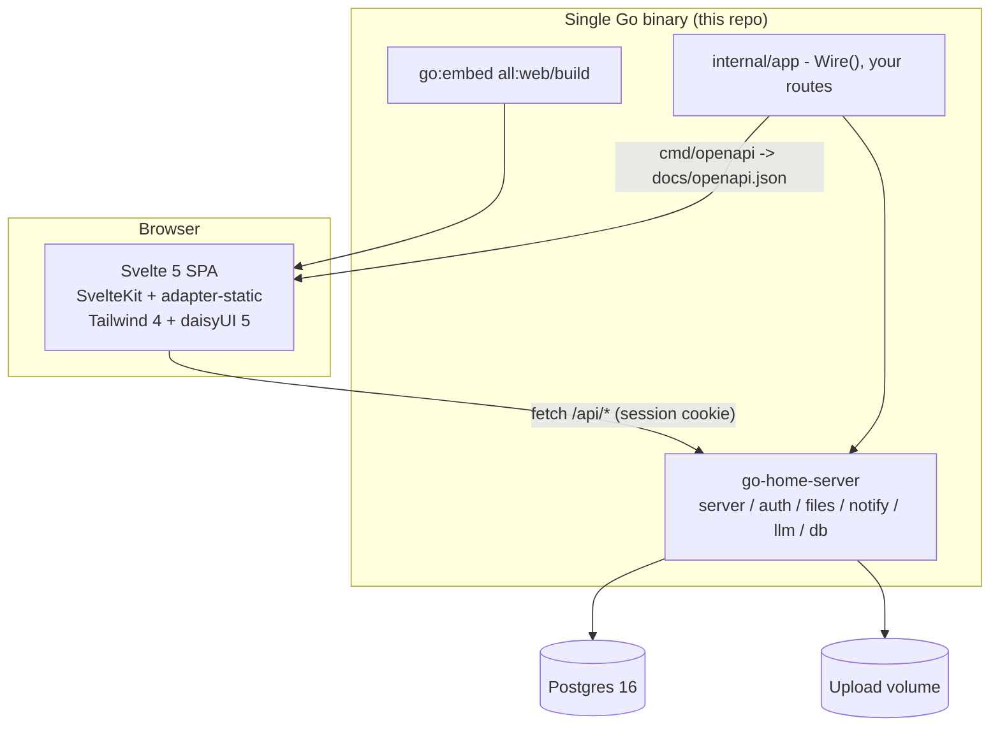

# Tech stack

Status: proposed
Date: 2026-07-29

This is the architecture decision record for `go-home-template`. It covers what
the stack is, why each piece is here, and what I deliberately left out. Read it
before adding a dependency.

Every claim about `go-home-server` below was checked against its source, and the
document was reviewed adversarially before being committed. Where something is
an accepted risk rather than a solved problem, it says so.

## What this repo is

`go-home-template` is the **app-shaped half** of my stack. It is the thing you
click "Use this template" on to start a new single-user app.

[`robert-crandall/go-home-server`](https://github.com/robert-crandall/go-home-server)
is the other half: a Go module that owns auth, Postgres wiring, file uploads,
web push, the LLM client, the MCP harness, and the HTTP bootstrap. It is
deliberately *only* a Go module, because that is the part that can physically be
an imported dependency and pick up fixes with `go get -u`.

Everything that can't be imported lives here: the Svelte SPA, the Vite/Tailwind
config, the Dockerfile, the compose file, and the CI/CD workflows. Those get
copied once per app and then diverge, which is exactly why they belong in a
template rather than a library.

The split in one line: **`go-home-server` is vendored, `go-home-template` is
forked.**



## Decisions at a glance

| Layer | Choice | Version at time of writing |
|---|---|---|
| Backend foundation | `go-home-server` | latest |
| Language | Go | 1.26 |
| HTTP | chi + huma (from the foundation) | - |
| Database | Postgres, one instance | 16 |
| Migrations | goose, via `db.Migrate` | - |
| Frontend | Svelte + SvelteKit, `adapter-static` in SPA mode | 5.x / 2.x / 3.x |
| Build tool | Vite | 8.x |
| Styling | Tailwind CSS + daisyUI | 4.x / 5.x |
| API client | `openapi-typescript` + `openapi-fetch` | 7.x / 0.17.x |
| Packaging | one static binary, SPA embedded | - |
| Container | multi-stage build to distroless | - |
| Orchestration | Docker Compose | - |
| CI/CD | GitHub Actions + Dependabot + auto-merge | - |

## Decisions

### D1 - The backend is `go-home-server`, imported, not copied

`cmd/server/main.go` starts life as a copy of the foundation's
`examples/minimal/main.go` and grows from there. Everything the foundation
already solves (sessions, cookies, bcrypt, API tokens, file uploads with
thumbnails, web push, graceful shutdown, `/healthz`) comes in as a dependency.

**Why:** the whole point of the foundation is that a security fix lands once and
every app picks it up with `go get -u`. Vendoring the source into the template
would break that on day one.

**Consequence:** the template must not reimplement anything the foundation
offers. If a template app needs different auth behavior, the fix goes upstream.
When in doubt, the rule is: *does this need to know about my app's domain?* If
no, it probably belongs in `go-home-server`.

### D2 - Postgres, one instance, and the template ships zero application tables

The foundation's migrations create five data tables (`users`, `sessions`,
`push_subscriptions`, `api_tokens`, `files`) plus goose's own
`goose_shared_version` bookkeeping table. There is no `file_thumbnails` table:
thumbnails are sidecar files on disk and migration `00006` only adds a
`has_thumbnail` boolean column to `files`.

The template applies exactly those and nothing else. There is no `migrations/`
directory here. `main.go` carries the second `db.MigrationSource` as a commented
block, the way `examples/minimal` does.

**Why:** a template that ships a `notes` table makes every new app start with a
deletion chore, and a half-deleted example table is worse than no example.

**Why not ship an empty `migrations/` package:** `//go:embed *.sql` fails to
compile when no `.sql` file matches, so a migrations package can't be literally
empty. You can get around that with `//go:embed all:.` over a directory holding
only a README, and that shape would compile. I'm not doing it, because the
package would then exist purely to be imported later, and the `MigrationSource`
would still have to stay commented out: **registering a second source at all
makes goose create a version table for it**, so an app with no migrations of its
own would get an extra table it didn't ask for. A package that must not be used
yet is worse than no package.

The honest cost: adding the first migration is not literally "uncomment three
lines." It's create `migrations/migrations.go` (eight lines, copied from the
foundation's), write `00001_whatever.sql`, then uncomment the source. The README
spells that out.

**Tradeoff, stated plainly:** the template's own CI therefore never exercises
the two-migration-source path. `go-home-server`'s `db` tests do, so the risk is
that the *comment* rots, not the code. Keeping the comment byte-identical to
`examples/minimal` is the mitigation.

**Why one Postgres and no cache layer:** these are single-user homelab apps. One
Postgres is the whole data tier. Redis, a queue, and a read replica are all
things to add when something actually hurts.

### D3 - OpenAPI is the contract, and the generated spec is committed

huma generates the OpenAPI spec from the Go handler types. The template turns
that into a build artifact:

1. `internal/app/wire.go` exposes one function, `Wire(api huma.API, deps Deps)`,
   which registers every operation (the foundation's and the app's). It is the
   only place routes are mounted.
2. `cmd/server` calls `Wire` with live dependencies.
3. `cmd/openapi` calls `Wire` with **spec-mode dependencies** and marshals
   `srv.API.OpenAPI()` to `docs/openapi.json`.
4. `web/src/lib/api/schema.d.ts` is generated from that JSON by
   `openapi-typescript`.
5. CI regenerates both and fails if the committed copies differ.

**Spec-mode dependencies are not zero values.** huma only reflects handler types
at registration time, so no database is needed, but the services still have to
be *constructed*. That means a real `auth.NewService(nil, true)`, a real
`notify.NewService(nil, notify.VAPID{})`, and a real
`files.NewService(nil, files.Options{Dir: tmp})` where `tmp` is a temp directory
that actually exists and is writable, because `files.NewService` stats the
directory and write-probes it. A nil `*auth.Service` would panic in
`RegisterTokens`. The foundation's `internal/wiring` test does exactly this, and
the template copies the pattern.

The invariant that makes this work, and the thing to enforce: **registration may
capture a dependency but must never call one.** An app route whose `huma.Register`
call reads from Postgres to build an enum, say, breaks spec generation. The
template ships a test that runs `Wire` with spec-mode deps and no `DATABASE_URL`
in the environment, so violating that invariant fails CI rather than the next
release.

**Why a `Wire` function instead of registering routes in `main`:** two binaries
need the same route set, and a spec generated from a *different* wiring than the
one that serves traffic is worse than no spec.

**Why `openapi-typescript` + `openapi-fetch` over a full client generator:**
`openapi-fetch` is a thin typed wrapper over `fetch` (roughly 6 kB minified)
that reads the generated types directly. Generators like Orval or hey-api emit a
class per tag and a runtime, which is a lot of machinery for an app with a dozen
endpoints. If the API grows past that, switching is contained because only
`web/src/lib/api/` imports it.

**Why commit the spec instead of generating at build time:** the diff is the
review. A PR that silently changes a response shape shows up as a spec diff,
which is the single most useful signal in the whole CI run. huma marshals the
spec with `encoding/json`, so the byte output is stable run to run; pin the
`openapi-typescript` version so `schema.d.ts` is too.

**Known wart:** huma's default config installs a schema-link transformer, so
request and response body schemas both grow a read-only optional `$schema`
field, and the generated TypeScript types will show it on both sides. Harmless,
but don't be surprised by it.

### D4 - SvelteKit with `adapter-static`, in SPA mode

Svelte 5 (runes) and SvelteKit 2, built by `@sveltejs/adapter-static` with
`fallback: 'index.html'` and `export const ssr = false` in the root layout.
Output goes to `web/build/`, which `web/dist.go` embeds:

```go
//go:embed all:build
var buildFS embed.FS

// Dist is the built SPA rooted at index.html, which is what
// server.Options.SPA expects.
var Dist, _ = fs.Sub(buildFS, "build")
```

**Why SvelteKit and not plain Vite + Svelte:** the template needs routing,
layouts, and a place to put per-route data loading on day one. Plain Vite means
picking a third-party router, and the Svelte 5 router landscape is thin. Turning
SSR off in SvelteKit costs one line and keeps file-based routing, `$app/state`,
and the documentation everyone reads.

**Why SPA mode and not SSR:** SSR would need a Node runtime next to the Go
binary, which destroys the single-binary deploy. There is no SEO requirement and
no cold-start-sensitive first paint here. This is the one decision that would be
genuinely expensive to reverse, and I'm taking it deliberately.

**Why `all:` in the embed directive:** SvelteKit emits `_app/`, and plain
`//go:embed build` skips directories starting with `_`. Without `all:` the app
compiles, boots, serves `index.html`, and then 404s every script.

**The build-order consequence, which is the sharpest edge in this whole
document:** `//go:embed all:build` means **`go build ./...` fails on a clean
checkout** until the frontend has been built at least once, because the embed
pattern matches nothing. That is not a bug to work around by committing the
bundle. It is a build graph, and it has to be respected everywhere:

- `make build` runs `npm run build` before `go build`. `make setup` does it once
  after clone, and the README's first instruction is `make setup`.
- CI runs the `web` job first and passes `web/build` to the Go, e2e, and Docker
  jobs as an artifact (D9).
- `web/build/` is gitignored. Nothing generated is committed except
  `docs/openapi.json` and `schema.d.ts`, which are reviewable text.

Locally this bites exactly once per clone: after the first `make setup`,
`web/build` exists on disk and bare `go test ./...` works normally.

**Deep links work** because the foundation's not-found handler already falls
back to `index.html` for non-`/api` paths and returns a JSON 404 for unknown
`/api` paths. `fallback: 'index.html'` is the client-side half of the same
contract.

**Dev loop:** Vite dev server on 5173 proxying `/api` and `/healthz` to the Go
server on 8080. Cookies are keyed by host and not by port, so the session cookie
set by `localhost:8080` through the proxy is sent back by the page on
`localhost:5173`. `APP_ENV=development` leaves `Secure` off, so it works over
plain HTTP.

### D5 - Tailwind CSS 4 and daisyUI 5 for theming

Tailwind 4 via `@tailwindcss/vite`, configured CSS-first. daisyUI is loaded as a
Tailwind plugin from the stylesheet, with no `tailwind.config.js` at all:

```css
@import "tailwindcss";
@plugin "daisyui" {
  themes: light --default, dark --prefersdark;
}
```

Theme selection is `data-theme` on `<html>`, persisted in `localStorage`, with a
tiny inline script in `app.html` that applies the saved theme *before* the app
boots. Without that script a static SPA paints the default theme for a frame and
then snaps to the user's choice.

**Why daisyUI:** it gives semantic component classes (`btn`, `card`, `input`,
`navbar`) and a real theme system on top of Tailwind, so a template app looks
finished without me hand-rolling a design system. Theming is the specific reason
it's here: switching the entire palette is one attribute, and adding a custom
theme is a `@plugin "daisyui/theme"` block rather than a token refactor.

**Why not a component library like Skeleton or Flowbite-Svelte:** those own your
component API, so they're a much harder dependency to remove later. daisyUI is
CSS classes; the markup stays plain Svelte, and worst case I delete the plugin
and keep writing Tailwind.

**Consequence:** semantic color classes only (`bg-base-100`, `text-base-content`,
`btn-primary`). A hardcoded `bg-white` is a bug, because it survives the theme
switch and looks broken in dark mode.

### D6 - What the SPA does, which is almost nothing

The entire frontend:

- `/login` - email and password, with a register tab. Surfaces the foundation's
  real errors: 403 when registration is closed, 409 when the email is taken,
  401 on a bad login.
- `/` - guarded. Says hello to `user.email`, shows a theme switcher and a logout
  button. This is the "hello world."
- A route guard that calls `GET /api/auth/me` once on boot and redirects to
  `/login` on 401.

That is the whole list. No file upload demo, no API token screen, no push
subscription UI, no `src/routes/demo/` folder.

**Why so little:** every screen in a template is a screen someone has to read,
understand, and then delete, which is the same tax as the example database table
in D2. Login and hello world are the two that prove the whole stack works end to
end: cookie auth, the generated client, the embedded SPA, deep-link fallback,
and theming. A third screen proves nothing new about the stack and costs every
app that starts here.

The template does ship static PWA metadata (`manifest.webmanifest`, icons)
because it's inert markup with no code to delete. It does **not** ship a service
worker: SvelteKit auto-registers `src/service-worker.ts` in production builds, so
a half-considered one is an asset-caching bug waiting to happen in every app that
forgets it's there. See "Deliberately not here" for the web push consequence.

### D7 - One binary, no reverse proxy in the container

The Go binary serves the API and the SPA on one port. No nginx, no Caddy sidecar,
no CORS configuration, no separate frontend deploy, no `VITE_API_URL`.

**On CSRF, stated accurately.** The session cookie is `SameSite=Lax`, which is
what stops an ordinary cross-site page from POSTing to the API with your cookie
attached. Two caveats that are accepted rather than solved:

- Every cookie-authenticated `/api` request, **including GET**, slides the
  session's `expires_at` and re-sends the cookie. So a cross-site top-level
  navigation (which Lax does allow) can extend a session. It cannot read the
  response or change anything else.
- Lax is same-*site*, not same-*origin*. A hostile origin under the same
  registrable domain is still same-site. That matters for a shared apex domain
  and not much otherwise.

Neither is worth code at this threat model, but don't read "SameSite=Lax" as
comprehensive CSRF protection, and don't bolt on a CSRF token library thinking
something is missing.

TLS termination is somebody else's job (Cloudflare Tunnel, Tailscale, or a
reverse proxy on the host). The container speaks plain HTTP.

### D8 - Multi-stage Docker build to distroless

```
web-build   --platform=$BUILDPLATFORM  node:22-alpine  npm ci && npm run build
go-build    --platform=$BUILDPLATFORM  golang:1.26     CGO_ENABLED=0 GOOS=$TARGETOS GOARCH=$TARGETARCH go build
runtime                                distroless/static-debian12:nonroot
```

Both build stages are pinned to `$BUILDPLATFORM` so neither ever runs under QEMU;
the Go stage cross-compiles to `$TARGETARCH`. A multi-arch (amd64 + arm64) build
is then two native compiles rather than one native compile plus one emulated
one. Go cross-compiles for free, and there's no reason to pay the emulation tax.
`$TARGETOS` is declared alongside `$TARGETARCH` rather than hardcoding `linux`,
so the `ARG`s and the build command can't drift apart.

`CGO_ENABLED=0` matters twice: it's what makes `distroless/static` viable, and
it's consistent with the foundation's decision not to support HEIC/AVIF
thumbnails, which would have dragged in cgo.

**Healthchecks:** distroless has no shell and no curl, so `HEALTHCHECK CMD curl`
does not work. The binary gets a `healthcheck` subcommand that hits its own
`/healthz` and exits 0 or 1. Three details that make it correct rather than
merely present: it dispatches on `os.Args[1]` *before* any config load or
migration work; it takes the **port** from `ADDR` and always dials
`127.0.0.1:<port>`, because `ADDR` defaults to `:8080` and can be `0.0.0.0:8080`
or `[::]:8080`, none of which are dialable as-is; and the Dockerfile uses
exec-form `HEALTHCHECK` because there's no shell to parse the string form.

**Compose** runs the app, Postgres 16 with a named volume, and a bind mount for
`UPLOAD_DIR`. Both services get `restart: unless-stopped`, so a host reboot or a
crash-looping first boot recovers without me. Two things that will otherwise
break on a first `docker compose up`:

- `db.Migrate` has no connection retry, so the app must wait on
  `condition: service_healthy` against a real Postgres healthcheck, not just
  `depends_on`.
- `distroless:nonroot` runs as UID 65532, and a Compose-created bind mount is
  root-owned on a Linux host. `files.NewService` write-probes `UPLOAD_DIR` and
  refuses to start if it can't write, so the host directory has to exist and be
  **writable by** UID 65532. Ownership is the simplest way to get there
  (`chown 65532:65532`) but group permissions or an ACL work too, and on Docker
  Desktop or rootless Docker the mapping differs and it may need nothing at all.
  The README's setup step does the Linux case and says why.

That refusal is a feature, not an obstacle: it means a missing or unwritable
volume is a startup crash instead of photos written into a container layer that
the next deploy discards.

### D9 - CI, CD, and Dependabot

CI on every PR and push to main. The job graph matters because of the embed
described in D4, and because nothing should be publishable before it's tested:

| Job | Needs | What it runs |
|---|---|---|
| `web` | - | `npm ci`, `svelte-check`, `eslint`, `vitest run`, `npm run build`, upload `web/build` |
| `go` | `web` | download artifact, then `go build ./... && go vet ./... && go test ./...` |
| `spec` | - | `go run ./cmd/openapi`, `npm ci` + `openapi-typescript`, fail on diff |
| `e2e` | `web` | download artifact, build the real binary, run it against Postgres, run Playwright |
| `docker-build` | - | `docker buildx build` for amd64 + arm64, cache output only. PRs stop here |
| `publish` | `go`, `spec`, `e2e` | main and tags only: build both platforms and push to GHCR |

`spec` needs no artifact: `go run ./cmd/openapi` only compiles `cmd/openapi` and
its imports, and `web/dist.go` isn't one of them. `go build ./...` in the `go`
job does compile it, which is why that job needs the artifact.

`docker-build` and `publish` are separate jobs rather than one job with an `if`,
because a multi-platform `buildx` result can't be `--load`ed into the local
daemon. The PR job therefore builds to cache and asserts only that the
Dockerfile still works, while `publish` builds and pushes in one step after the
tests that actually mean something have passed.

The E2E spec is one flow: register the first user, land on hello world, toggle
the theme, log out, log back in. It is the only test that exercises the embedded
SPA, the cookie round trip, and the deep-link fallback together, which is why
it's worth the Playwright dependency.

Two notes on the details:

- `go test ./...`, not `go test -p 1 ./...`. The foundation needs `-p 1` because
  its own `auth` and `files` integration test packages share one database and
  wipe `users` on setup. Nothing in the template does that. Add `-p 1` the day
  you add a second package with database integration tests, not before, and add
  the Postgres service to the `go` job on the same day. Until then only `e2e`
  needs a database.
- The GHCR image path comes from `${{ github.repository }}`, so a repo created
  from this template publishes under its own name without anyone editing a
  workflow.

`publish` tags the image `:main`, `:<sha>`, and `:v1.2.3`. Deployment is
`docker compose pull && docker compose up -d` on the host; I'm not putting a
deploy key in GitHub Actions for a homelab box.

Dependabot covers four ecosystems weekly: `gomod` (`/`), `npm` (`/web`),
`github-actions` (`/`), and `docker` (`/`). Minor and patch updates are grouped
into one PR per ecosystem; majors come as standalone PRs so they're at least
legible.

The foundation's `dependabot-auto-merge.yml` is copied verbatim, including the
two guards that make it **race-safe**: it skips if main advanced after CI ran,
and it merges with `--match-head-commit` so a Dependabot force-push after CI
can't sneak an untested tip into main.

Race-safe is not the same as safe. Majors auto-merge too, and CI's E2E flow
covers auth and the SPA shell but not files, push, tokens, or MCP. That's an
accepted risk with one caveat worth stating plainly: **rolling back the GHCR tag
does not roll back the database.** Startup runs goose `Up` only, so a foundation
release carrying a migration has already changed the schema by the time you
notice. Recovering from that needs a database restore, which is one more reason
the backup story below is not optional. If a repo built from this template ever
holds data I'd be sad to restore from last night's dump, gate majors first.

**Why `workflow_run` auto-merge instead of branch protection plus native
auto-merge:** native auto-merge needs a required-status-check blocker on main,
which also blocks direct pushes to main. This keeps main unprotected for me
while still gating Dependabot on green CI. That reasoning is the foundation's
and I'm keeping it.

### D10 - Renaming the template is the first step, before anything is generated

A repo created from a GitHub template keeps this repo's identity until someone
changes it, and Go makes that more visible than most stacks: the module path is
in `go.mod` and every internal import, and `mcp.AppName` derives the MCP server
binary name and its `~/.config/<app>.json` path from the *basename* of the main
module path.

So the template ships `make init MODULE=github.com/owner/repo NAME=my-app`,
defaulting `MODULE` from the `origin` remote so the usual case is just
`make init`. It runs `go mod edit -module`, rewrites internal imports, and
updates the app title, binary name, compose service name, npm package name, and
the PWA manifest.

Two constraints on its design:

- **A name alone isn't enough.** `github.com/<owner>/<repo>` can't be derived
  from `my-app`, which is why `MODULE` exists as a separate input.
- **Rename first, generate second.** `docs/openapi.json` embeds the API title
  and `web/build` embeds the manifest, so running `make setup` before
  `make init` leaves generated output carrying the old identity. `make init`
  therefore regenerates both at the end and fails if any old identifier
  survives anywhere in the tree. That last check is what makes this reliable
  rather than a checklist people half-follow.

The GHCR path is deliberately *not* rewritten: the workflow uses
`${{ github.repository }}` so there's nothing to rename.

This is boring, and skipping it is how you end up with three apps that all think
they're called `go-home-template`.

### D11 - Optional pieces, off by default

Wired but inert unless configured, so an app opts in by setting an env var
rather than by writing plumbing:

- **API tokens** (`authSvc.RegisterTokens`) - on, because the MCP server needs
  them and they cost nothing when unused. No UI (D6); mint one with `curl`.
- **Web push** - the server half is registered, and stays disabled while both
  VAPID keys are empty. Note that it's both or neither: `notify.NewService`
  validates the pair (shape, P-256 sizes, and that the public key really derives
  from the private one) whenever *either* is set, so a half-configured app fails
  at startup rather than at send time. The browser half is not here; see below.
- **LLM** (`llm` package) - not wired. Add it when the app calls a model.
  `llm.New` fails at startup when no provider key is set, which is right for an
  app that uses it and wrong as a default for one that doesn't.
- **MCP server** (`cmd/mcp`) - shipped with zero tools registered and a comment
  showing how to add one. The foundation's rule stands: an MCP tool is a thin
  client of the app's own HTTP API and never owns domain logic.

## Environment

All of these come from `go-home-server`'s `config.Load` (plus an optional
`.env`); the template adds none of its own. `.env.example` ships with the
required ones filled in for local development.

| Variable | Required | Notes |
|---|---|---|
| `DATABASE_URL` | yes | Postgres connection string |
| `ADDR` | no | defaults to `:8080` |
| `APP_ENV` | no | `production` turns on `Secure` cookies |
| `ALLOW_OPEN_REGISTRATION` | no | default is first-user-only |
| `UPLOAD_DIR` | yes | must already exist and be writable by UID 65532 |
| `UPLOAD_MAX_BYTES` | no | defaults to 25 MiB |
| `VAPID_PUBLIC_KEY` / `VAPID_PRIVATE_KEY` / `VAPID_SUBJECT` | no | both keys or neither; one alone is a startup error |
| `SESSION_SECRET` | no | read but unused by the foundation |

## Operations

The parts that make this a deployable app rather than a demo, and that a
homelab template gets wrong by omission more often than by design:

- **Backups.** Two things to back up and they're easy to get half right: a
  `pg_dump` of Postgres *and* the `UPLOAD_DIR` tree, because file bytes live on
  disk and only their metadata is in the database. A restore of one without the
  other leaves rows pointing at missing files or orphaned files nobody can
  reach. The template ships `make backup` / `make restore` doing both together,
  and the README says to test the restore once rather than assume it.
- **Pulling the image.** GHCR packages are private by default, so the homelab
  host needs either `docker login ghcr.io` with a read-only PAT or the package
  set to public. The README covers both; pick one at setup time, not at 2am
  during a deploy.
- **Restarts.** `restart: unless-stopped` on both compose services, per D8.
- **Uptime.** `/healthz` returns 503 when the database ping fails, so point
  whatever you already run at it. The foundation gives this away for free as
  long as `server.Options.HealthCheck` is set to `pool.Ping`.

## Deliberately not here

- **SSR / server-side rendering.** See D4.
- **A service worker, and therefore the browser half of web push.** See D6. This
  is the most likely first addition to any app built from this template, and it
  is genuinely missing rather than unnecessary: the foundation stores
  subscriptions and sends pushes but says the frontend half is the app's to
  write, so today every app writes it from scratch. Written down as finding 6
  below rather than solved here.
- **A state management library.** Svelte 5 runes plus a couple of `.svelte.ts`
  modules cover a single-user app.
- **A component library.** See D5.
- **Redis, a job queue, a worker process.** Postgres and a goroutine until
  proven otherwise.
- **Kubernetes.** Compose on one box.
- **Multi-tenancy.** The foundation is first-user-only by default, and every
  foundation resource is scoped to a user id, so turning the app multi-user is
  `ALLOW_OPEN_REGISTRATION=true` and nothing more *for the foundation's
  endpoints*. Your own tables and handlers still have to do their own per-user
  authorization; nothing enforces that for you.
- **Rate limiting, a WAF, security headers middleware.** See the threat model.

## Threat model

Single-user apps on a private network, reachable through a tunnel rather than a
public IP. A failure mode that needs a hostile party already inside the LAN, or
that I can undo by re-registering, gets documented rather than coded around.
This mirrors `go-home-server`'s "Acknowledged, not fixed" section, and the same
request applies: if you think one of these has actually become a problem, make
the case rather than opening a hardening PR.

Accepted here:

- **No login rate limiting.** bcrypt at default cost is the throttle, and the
  endpoint isn't on the public internet. The foundation does compare against a
  dummy hash on the unknown-user path, so login timing doesn't leak whether an
  email exists.
- **huma's default metadata routes are unauthenticated.** `huma.DefaultConfig`
  mounts `/docs`, `/openapi.json`, `/openapi.yaml` (plus the 3.0 variants), and
  `/schemas/{schema}`. They leak the API shape, not data. Worth knowing that
  this is currently unavoidable rather than a choice: `server.New` takes no huma
  config, so an app can't turn them off without bypassing the foundation's
  bootstrap. See finding 8.
- **The CSRF caveats in D7.**
- **The first-user registration window**, inherited from the foundation.
- **Dependabot auto-merges major versions**, per D9.

## Findings for `go-home-server`

Things this template ran into that look like they belong upstream. Each was
verified against the source. None is blocking; the template can ship around all
of them. All are filed as issues on `go-home-server`, linked per finding.

1. **`setSPACacheControl` only knows about `assets/`** (`server/server.go:225`,
   [#14]).
   It marks `assets/*` immutable and everything else `no-cache`, which is right
   for a plain Vite build. SvelteKit's static adapter puts its content-hashed
   output under `_app/immutable/` instead, so every JS chunk gets revalidated on
   every load. It's correct, just slower, and behind Cloudflare it means an
   origin round trip per asset. Either match `_app/immutable/` alongside
   `assets/`, or make the immutable prefixes a field on `server.Options`.
   *Highest value of the list, since it silently affects any SvelteKit app.*

2. **The OpenAPI spec declares no security schemes at all** ([#15]). There is no
   `Security:` field on any `huma.Operation` in the module, so the generated
   spec presents `/api/files`, `/api/tokens`, `/api/push/*`, and `/api/auth/me`
   as unauthenticated. To be precise about the impact: a same-origin cookie
   client like `openapi-fetch` still works fine, because the browser attaches
   the cookie regardless of what the spec says. What breaks is everything that
   *reads* the security metadata: the rendered docs, anyone writing a
   non-browser client, and generators that provision auth from the spec.
   Defining a cookie scheme and a bearer scheme and attaching them per operation
   is a contained change with a large accuracy payoff.

3. **`Errors` is declared unevenly, so most error responses are undocumented**
   ([#17]).
   Only four operations enumerate their errors: `register` (403/409/422,
   `auth/auth.go:430`) and the three token operations (`auth/tokens.go:360`,
   `:399`, `:418`). `login` returns 401 and doesn't say so; `current-user`
   returns 401 through `RequireUser` and doesn't say so; `logout` can return 500
   when it can't revoke the session; every protected file and push operation is
   in the same position; and the token operations themselves omit the 401 that
   `RequireSessionUser` can return. Worth one audit pass rather than a one-line
   fix.

4. **The nil-pool spec-generation pattern is only documented in a test** ([#19]).
   `internal/wiring` proves you can register every endpoint against a nil
   `*pgxpool.Pool` to marshal the OpenAPI spec without a database, which is what
   an app wants if it generates its typed frontend client offline (scraping
   `/openapi.json` from a running server is the other option, and needs a
   running server). Right now the pattern is rediscovered by reading a test in
   an internal package. It also has two non-obvious corners: `files.NewService`
   stats and write-probes its directory (`files/files.go:101`), so it needs a
   real temp dir, and `RegisterTokens` dereferences the service
   (`auth/tokens.go:357`), so a nil `*auth.Service` panics. A short README
   section beats a helper here, because a `server.WriteOpenAPI` helper can't see
   the app's own routes and so would only ever produce half the spec.

5. **`server.Options.SPA` silently accepts a wrongly-rooted `fs.FS`** ([#18]). It needs
   `index.html` at the root, so apps must write `fs.Sub(embedded, "build")`.
   Forget it and the app builds, boots, and serves "index.html not found in
   embedded SPA" at request time (`server/server.go:233`). A startup check when
   `SPA != nil` would turn that into a boot crash, which is the same philosophy
   as `UPLOAD_DIR` refusing to create its own directory.

6. **The browser half of web push has no home** ([#20]). The README correctly says the
   service worker and subscribe flow belong to the app, but the result is that
   every app writes the same 60 lines of `registration.pushManager.subscribe`,
   base64url VAPID key decoding, and a `push`/`notificationclick` handler from
   scratch, and gets the key decoding wrong the first time. That code can't be a
   Go package, but it could be a documented snippet in the README next to the
   `notify` section. Not code, just the missing half of an existing feature's
   documentation.

7. **Two things worth a line in the README rather than a fix** ([#21], [#22]). The CSRF posture
   (`SameSite=Lax`, plus the fact that session sliding means even GET mutates
   `expires_at`, `auth/auth.go:240`) is a real invariant that's currently
   implicit, and it belongs in "Acknowledged, not fixed" so the next app author
   neither bolts on a redundant CSRF token nor assumes protection that isn't
   there. And the `//go:embed all:build` trap from D4 will bite anyone embedding
   a SvelteKit build; one sentence in "Start a new app" would cover it, without
   the module having to know anything about SvelteKit's layout.

8. **`server.New` hardcodes `huma.DefaultConfig` with no seam**
   (`server/server.go:91`, [#16]). `Options` exposes `Title`, `Version`, `Addr`, `SPA`,
   `Middlewares`, and `HealthCheck`, but nothing that reaches the huma config.
   So an app can't move or disable `/docs`, `/openapi`, and `/schemas`, can't
   add security schemes to `Components`, and can't change the docs renderer,
   without giving up `server.New` and rebuilding the router itself. That last
   one is the sharp bit: it also blocks the clean fix for finding 2. An
   `Options.HumaConfig func(huma.Config) huma.Config` hook, applied after
   `DefaultConfig`, would cover all of it in about four lines and keep the
   default behavior identical for apps that don't set it.

[#14]: https://github.com/robert-crandall/go-home-server/issues/14
[#15]: https://github.com/robert-crandall/go-home-server/issues/15
[#16]: https://github.com/robert-crandall/go-home-server/issues/16
[#17]: https://github.com/robert-crandall/go-home-server/issues/17
[#18]: https://github.com/robert-crandall/go-home-server/issues/18
[#19]: https://github.com/robert-crandall/go-home-server/issues/19
[#20]: https://github.com/robert-crandall/go-home-server/issues/20
[#21]: https://github.com/robert-crandall/go-home-server/issues/21
[#22]: https://github.com/robert-crandall/go-home-server/issues/22
