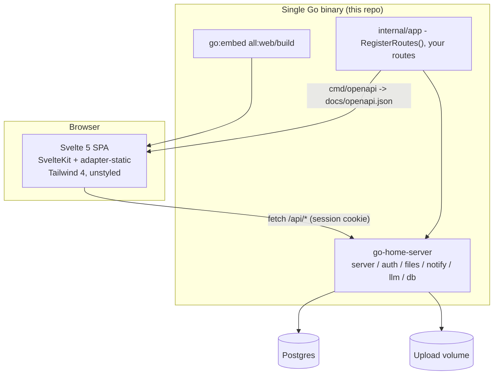

# Tech stack

Status: proposed
Date: 2026-07-29

This is the architecture decision record for `go-home-template`. It covers what
the stack is, why each piece is here, and what I deliberately left out. Read it
before adding a dependency.

Every claim about `go-home-server` below was checked against its source, and the
document was reviewed adversarially before being committed. Where something is
an accepted risk rather than a solved problem, it says so.

## What this repo is

`go-home-template` is the **app-shaped half** of my stack. It is the thing you
click "Use this template" on to start a new single-user app.

[`robert-crandall/go-home-server`](https://github.com/robert-crandall/go-home-server)
is the other half: a Go module that owns auth, Postgres wiring, file uploads,
web push, the LLM client, the MCP harness, and the HTTP bootstrap. It is
deliberately *only* a Go module, because that is the part that can physically be
an imported dependency and pick up fixes with `go get -u`.

Everything that can't be imported lives here: the Svelte SPA, the Vite/Tailwind
config, the Dockerfile, and the CI/CD workflows. Those get
copied once per app and then diverge, which is exactly why they belong in a
template rather than a library.

The split in one line: **`go-home-server` is a dependency, `go-home-template` is
a starting point.** You `go get` the first and never edit it; you fork the second
and immediately diverge.



## Decisions at a glance

| Layer | Choice | Version at time of writing |
|---|---|---|
| Backend foundation | `go-home-server` | >= v0.1.9 |
| Language | Go | 1.26 |
| HTTP | chi + huma (from the foundation) | - |
| Database | Postgres, one instance | >= 14; CI tests on 18 |
| Migrations | goose, via `db.Migrate` | - |
| Frontend | Svelte + SvelteKit, `adapter-static` in SPA mode | 5.x / 2.x / 3.x |
| Build tool | Vite | 8.x |
| Package manager | Bun - no Node required | 1.3.x |
| Styling | Tailwind CSS, and nothing on top of it | 4.x |
| API client | `openapi-typescript` + `openapi-fetch` | 7.x / 0.17.x |
| Packaging | one static binary, SPA embedded | - |
| Container | multi-stage build to distroless | - |
| Orchestration | Docker Compose, on the host - not in this repo | - |
| Deployment | GHCR + Watchtower | - |
| CI/CD | GitHub Actions + Dependabot + auto-merge | - |

## Decisions

### D1 - The backend is `go-home-server`, imported, not copied

`cmd/server/main.go` starts life as a copy of the foundation's
`examples/minimal/main.go` and grows from there. Everything the foundation
already solves (sessions, cookies, bcrypt, API tokens, file uploads with
thumbnails, web push, graceful shutdown, `/healthz`) comes in as a dependency.

**Why:** the whole point of the foundation is that a security fix lands once and
every app picks it up with `go get -u`. Vendoring the source into the template
would break that on day one.

**Minimum version: v0.1.9.** See "Foundation version" at the end.

**Consequence:** the template must not reimplement anything the foundation
offers. If a template app needs different auth behavior, the fix goes upstream.
When in doubt, the rule is: *does this need to know about my app's domain?* If
no, it probably belongs in `go-home-server`.

### D2 - Postgres, one instance, and the template ships zero application tables

The foundation's migrations create five data tables (`users`, `sessions`,
`push_subscriptions`, `api_tokens`, `files`) plus goose's own
`goose_shared_version` bookkeeping table. There is no `file_thumbnails` table:
thumbnails are sidecar files on disk and migration `00006` only adds a
`has_thumbnail` boolean column to `files`.

The template applies exactly those and nothing else. There is no `migrations/`
directory here. `main.go` carries the second `db.MigrationSource` as a commented
block, the way `examples/minimal` does.

**Why:** a template that ships a `notes` table makes every new app start with a
deletion chore, and a half-deleted example table is worse than no example.

**Why not ship an empty `migrations/` package:** `//go:embed *.sql` fails to
compile when no `.sql` file matches, so a migrations package can't be literally
empty. You can get around that with `//go:embed all:.` over a directory holding
only a README, and that shape would compile. I'm not doing it, because the
package would then exist purely to be imported later, and the `MigrationSource`
would still have to stay commented out: **registering a second source at all
makes goose create a version table for it**, so an app with no migrations of its
own would get an extra table it didn't ask for. A package that must not be used
yet is worse than no package.

The honest cost: adding the first migration is not literally "uncomment three
lines." It's create `migrations/migrations.go` (eight lines, copied from the
foundation's), write `00001_whatever.sql`, then uncomment the source. The README
spells that out.

**Tradeoff, stated plainly:** the template's own CI therefore never exercises
the two-migration-source path. `go-home-server`'s `db` tests do, so the risk is
that the *comment* rots, not the code. Keeping the comment byte-identical to
`examples/minimal` is the mitigation.

**Why one Postgres and no cache layer:** these are single-user homelab apps. One
Postgres is the whole data tier. Redis, a queue, and a read replica are all
things to add when something actually hurts.

### D3 - OpenAPI is the contract, and the generated spec is committed

huma generates the OpenAPI spec from the Go handler types. The template turns
that into a build artifact:

1. `internal/app/routes.go` exposes one function, `RegisterRoutes(api huma.API,
   deps Deps) error`, which mounts every operation (the foundation's and the
   app's). It is the only place routes are registered. The name matches the
   foundation's README so the two read as one instruction.
2. `cmd/server` calls it with live dependencies.
3. `cmd/openapi` calls it with **spec-mode dependencies** and marshals
   `srv.API.OpenAPI()` to `docs/openapi.json`.
4. `web/src/lib/api/schema.d.ts` is generated from that JSON by
   `openapi-typescript`.
5. CI regenerates both and fails if the committed copies differ.

Steps 2 and 3 sharing one function is the whole point: a spec generated from a
*different* wiring than the one that serves traffic is worse than no spec.

**Spec-mode dependencies are not zero values.** huma only reflects handler types
at registration time, so no database is needed, but the services still have to
be *constructed*: `auth.NewService(nil, true)`, `notify.NewService(nil,
notify.VAPID{})`, and `files.NewService(nil, files.Options{Dir: tmp})` with a
real writable temp dir, because `files.NewService` stats and write-probes it.
`server.Options.HumaConfig` has to be set to `authSvc.TokenHumaConfig` here too,
because the template enables API tokens and `RegisterTokens` panics without it
(D11). As of v0.1.4 the foundation's README documents this whole pattern with a
worked `cmd/openapi`, so the template follows it rather than inventing its own.

The invariant to enforce: **registration may capture a dependency but must never
call one.** An app route whose `huma.Register` call reads from Postgres to build
an enum, say, breaks spec generation. The template ships a test that runs
`RegisterRoutes` with spec-mode deps and no `DATABASE_URL` in the environment,
so violating that invariant fails CI rather than the next release.

**The spec is worth generating because it now describes authentication.** As of
v0.1.4 every foundation operation declares `Security`, and every operation that
can fail enumerates its errors, so the generated types carry typed 401/403/404
variants and the rendered docs show which endpoints take a session cookie, which
also take a bearer token, and which are public. (The one operation without an
`Errors` list is `push-vapid-key`, which is public and has no failure path.)
Before that release the spec claimed the whole API was unauthenticated.

**The app's own routes get the same treatment**, via the `apisec` package
([#34]):

```go
huma.Register(api, huma.Operation{
    OperationID: "list-widgets",
    Method:      http.MethodGet,
    Path:        "/api/widgets",
    Errors:      []int{http.StatusUnauthorized},
    Security:    apisec.User(api),
}, listWidgets)
```

`apisec.User` is the one to reach for: it matches what `auth.Middleware` plus
`RequireUser` actually accept, and it decides whether to include bearer by
asking the API rather than guessing, so an app that drops API tokens (D11)
automatically gets a session-only requirement instead of a spec referencing a
scheme that isn't declared. `Session` is for credential-management routes,
`Public` for unauthenticated ones. Pass the same `api` you're registering the
operation on: these helpers also install the session scheme on it if it's
missing. The template never writes scheme names by hand; that was [#33], and
hand-written literals are exactly what `apisec` exists to stop.

`GET /api/app` is the one route the template registers itself, so it is also the
worked example rather than an invented one - `apisec.Public()`, because its
whole job is to be read by a signed-out visitor on the login page (D6). Under
the default gate it exposes one bit, whether a non-deleted account exists, which
`POST /api/auth/register` already gives away by refusing; with
`ALLOW_OPEN_REGISTRATION=true` it is a constant and exposes nothing.

**Why `openapi-typescript` + `openapi-fetch` over a full client generator:**
`openapi-fetch` is a thin typed wrapper over `fetch` (roughly 6 kB minified)
that reads the generated types directly. Generators like Orval or hey-api emit a
class per tag and a runtime, which is a lot of machinery for an app with a dozen
endpoints. If the API grows past that, switching is contained because only
`web/src/lib/api/` imports it.

**Why commit the spec instead of generating at build time:** the diff is the
review. A PR that silently changes a response shape shows up as a spec diff,
which is the single most useful signal in the whole CI run. huma marshals the
spec with `encoding/json`, so the byte output is stable run to run; pin the
`openapi-typescript` version so `schema.d.ts` is too.

**Known wart:** huma's default config installs a schema-link transformer, so
request and response body schemas both grow a read-only optional `$schema`
field, and the generated TypeScript types will show it on both sides. Harmless,
but don't be surprised by it.

### D4 - SvelteKit with `adapter-static`, in SPA mode

Svelte 5 (runes) and SvelteKit 2, built by `@sveltejs/adapter-static` with
`fallback: 'index.html'` and `export const ssr = false` in the root layout.
Output goes to `web/build/`, which `web/dist.go` embeds:

```go
//go:embed all:build
var buildFS embed.FS

// Dist is the built SPA rooted at index.html, which is what
// server.Options.SPA expects.
var Dist, _ = fs.Sub(buildFS, "build")
```

**Why SvelteKit and not plain Vite + Svelte:** the template needs routing,
layouts, and a place to put per-route data loading on day one. Plain Vite means
picking a third-party router, and the Svelte 5 router landscape is thin. Turning
SSR off in SvelteKit costs one line and keeps file-based routing, `$app/state`,
and the documentation everyone reads.

**Why SPA mode and not SSR:** SSR would need a Node runtime next to the Go
binary, which destroys the single-binary deploy. There is no SEO requirement and
no cold-start-sensitive first paint here. This is the one decision that would be
genuinely expensive to reverse, and I'm taking it deliberately.

**Why `all:` in the embed directive:** SvelteKit emits `_app/`, and plain
`//go:embed build` skips directories starting with `_`. Without `all:` the app
compiles, boots, serves `index.html`, and then 404s every script. This is the
one trap here that stays silent: `index.html` is embedded either way. Forgetting
`fs.Sub` is the loud one - since v0.1.4 `server.New` panics at startup with
`server: SPA has no index.html at its root - did you forget fs.Sub(embedded,
"build")?`.

**Caching lines up with SvelteKit's layout, measured rather than assumed.**
Booting the real `server.New(Options{SPA: web.Dist})` against the real embedded
build and walking every file in it gives:

| path | `Cache-Control` |
| --- | --- |
| `_app/immutable/**` (assets, chunks, entry, nodes) | `public, max-age=31536000, immutable` |
| `_app/version.json` | `no-cache` |
| `/`, `/login`, any deep link (the `index.html` fallback) | `no-cache` |
| `manifest.webmanifest`, `icon-*.png`, `*.svg` | `no-cache` |
| a chunk a deploy deleted, e.g. `_app/immutable/gone.js` | `no-cache` (200, `text/html`) |

That is exactly the split SvelteKit produces: content-hashed chunks under
`_app/immutable/`, everything with a stable name revalidated. **The template must
not put unhashed output under either prefix.** The last row is the one worth
noticing - a URL that no longer exists comes back as the SPA fallback, and it
comes back `no-cache`, so a dead chunk can never be poisoned into a cache
carrying the one-year header.

Every header in that table comes from a version-pinned dependency rather than
from code in this repo, so a bump can change any of it. `TestSPACacheHeaders`
pins the two rows a deploy depends on, and D6 says why those two. The
`index.html` fallback must carry `no-cache` or `no-store`. Everything under
`_app/immutable/` must carry `immutable` with a long `max-age`, must *not* carry
`no-cache` or `no-store`, and must have a content-hashed filename. The rest of
the table is a one-off measurement, true when written and not enforced.

`no-cache` is the right directive here and `must-revalidate` would be redundant:
it already means "store, but revalidate before use". `serveIndex` passes a zero
modtime to `http.ServeContent`, so `index.html` has no `Last-Modified` and a
revalidation is a full 200 rather than a 304 - that costs a few KB per load, it
does not permit stale reuse.

**What "works behind Cloudflare" means, precisely.** Stock Cloudflare caches by
file extension, and for the hashed JavaScript and CSS - which is the bulk of the
bytes - that is safe by filename alone: a new build gives them new names. The
cacheable-extension list also covers stable-name files this app serves, though,
the icons and the SVGs among them, so freshness for everything else rests on
Cloudflare honouring the origin's `no-cache`. It does: Origin Cache Control is on
by default on the free plan, and it stays true even with a Cache Everything rule.
HTML isn't on the extension list at all, so `/` and `/login` - the paths a deploy
has to reach - are not edge-cached by default in the first place. What breaks
this is a Cache Rule or Browser Cache TTL that *overrides* origin headers for
those stable paths. No code in this repo can defend against
that; the requirement is simply "let the origin decide for the stable paths".

**The build-order consequence, which is the sharpest edge in this whole
document:** `//go:embed all:build` means **`go build ./...` fails on a clean
checkout** until the frontend has been built at least once, because the embed
pattern matches nothing. That is not a bug to work around by committing the
bundle. It is a build graph, and it has to be respected everywhere:

- `make build` runs `bun run build` before `go build`. `make setup` does it once
  after clone, and the README's first instruction is `make setup`.
- CI makes the `go` and `integration` jobs depend on `web` and passes `web/build` to
  them as an artifact. The `docker-build` job doesn't need it - the Dockerfile's
  own `web-build` stage runs the same build inside the image, and
  `.dockerignore` excludes `web/build` so a local one can't leak in (D8, D9).
- `web/build/` is gitignored. Nothing generated is committed except
  `docs/openapi.json` and `schema.d.ts`, which are reviewable text.

Locally this bites exactly once per clone: after the first `make setup`,
`web/build` exists on disk and bare `go test ./...` works normally.

**Deep links work** because the foundation's not-found handler already falls
back to `index.html` for non-`/api` paths and returns a JSON 404 for unknown
`/api` paths. `fallback: 'index.html'` is the client-side half of the same
contract.

**Dev loop:** Vite dev server on 5173 proxying `/api` and `/healthz` to the Go
server on 8080. Cookies are keyed by host and not by port, so the session cookie
set by `localhost:8080` through the proxy is sent back by the page on
`localhost:5173`. `APP_ENV=development` leaves `Secure` off, so it works over
plain HTTP.

**Why Bun and not npm:** the prerequisite list is Go, Postgres, and one more
thing. Bun makes that one thing a single ~50MB binary that installs, runs
scripts, and executes JavaScript, instead of a Node install plus npm. Vite still
bundles - `bun build` is Bun's own bundler and is not in play here, and neither
is `bun test`. This is a toolchain swap, not a rewrite. Dependabot supports
`package-ecosystem: bun` for version updates (Bun >= 1.1.39), so nothing is lost
on the maintenance side either. The version is pinned in one place per surface
and both track the same minor: `bun-version: '1.3.x'` in CI, `oven/bun:1.3-alpine`
in the Docker builder. Patch floats within that minor; moving the minor is
deliberate maintenance and has to change both at once. Dependabot's `bun`
ecosystem updates the dependencies in `web/`, not either of these pins.

**One non-obvious consequence, and it's why `web/bunfig.toml` exists.** `vite`,
`svelte-kit`, and `svelte-check` are all installed with a `#!/usr/bin/env node`
shebang, and `bun run` respects that shebang by default - it only aliases `node`
to itself when `node` is *absent* from `$PATH`. Left alone, that means the same
`bun run build` builds under Node on a machine that has Node (a dev laptop, and
every GitHub runner, which ships Node preinstalled) and under Bun on the clean
clone this template is designed for. Two runtimes for one command, chosen by an
invisible property of the host, with CI exercising the one the template does not
require. `bunfig.toml` sets `[run] bun = true`, so there is one runtime
everywhere and CI tests the one a fresh clone gets. The trade is real and worth
naming: Vite under Bun is a less-travelled path than Vite under Node. Running it
on every PR is the mitigation.

That config is load-bearing but its failure is silent: if `bunfig.toml` goes
missing, lands in the wrong directory, or gets a typo'd key, Bun reports nothing
and quietly falls back to Node. Every other check still passes, because a build
under Node is a perfectly good build - it just isn't the one being promised. So
CI asserts the runtime directly (D9) rather than inferring it from a green
build.

**A second silent trap, same shape, different cause: what `svelte-check` looks
at.** SvelteKit generates `.svelte-kit/tsconfig.json`, while Vitest discovers
tests from the explicit `src/**/*.test.ts` pattern in `vite.config.ts`. Keeping
frontend tests under `web/src/` makes both tools see the same source tree.

### D5 - Tailwind CSS 4, and deliberately nothing on top of it

Tailwind 4 via `@tailwindcss/vite`, configured CSS-first. `web/src/app.css` is
one `@import 'tailwindcss'` and a comment. There is no component library, no
theme system, no design tokens, no `tailwind.config.js`, and no house style.

**This is the decision, not an absence of one.** A template's look is the one
part of it that every fork replaces, and anything shipped here has to be
understood and then removed before the replacing can start. Utilities are a
different kind of thing: `flex` and `p-4` are not an opinion about what your app
is, they are shorthand for CSS you were going to write anyway, and a fork that
wants none of it deletes one line from `app.css` and one plugin from
`vite.config.ts`.

**What this used to be, and why it went.** Through M7 the template shipped
daisyUI 5 for semantic component classes, a `light --default, dark --prefersdark`
theme pair, a System/Light/Dark picker persisted in `localStorage`, a
synchronous inline script in `app.html` that applied the saved theme before
first paint, a `--font-sans` override, and an `outline-offset: 0` fix that
existed only because daisyUI focuses controls with a 2px offset. All of it
worked. All of it was also this repo deciding what your app looks like, down to
the palette of the browser's own title bar, and every one of those pieces was
load-bearing for the next: the inline script existed because the theme system
did, the Go test in `web/dist_test.go` existed because the inline script did.
Removing the top of that stack removed the rest.

The same argument took `theme_color` and `background_color` out of
`manifest.webmanifest`. Deleting a `#1e293b` meta tag from `app.html` while
leaving the same `#1e293b` in the manifest would only move the opinion to the
installed app's title bar and splash screen. Both members are optional;
`name`, `icons`, `start_url`, `display` and `scope` stay, so installability is
untouched, and `web/dist_test.go` confirms the built manifest remains valid.

**One consequence worth knowing before you write a page: preflight is on.**
Tailwind's reset sets `border: 0 solid` on everything and
`background-color: transparent` on form controls, so an `<input>` with no
classes is an invisible box and a `<button>` is a word. That is Tailwind's
default and it stays the default here - a fork that types `border` and finds no
reset has been surprised in a worse way. What it means in practice is that the
two screens that ship carry a handful of *structural* classes: a border, some
padding, a rounded corner, a max width. Two classes are not structural, and both
are carrying meaning rather than taste: `text-2xl font-bold` on the home page's
heading, because a document with no other typography has no other way to say
"this is the heading", and `font-bold` on `/login`'s selected mode button, which
is the sighted-user half of the `aria-pressed` beside it - drop it and the
toggle still announces its state to a screen reader while telling everyone else
nothing. Beyond those, nothing in the SPA names a colour, a font family, or a
breakpoint.

**Adding a component library back is an install and a plugin block**, and
daisyUI in particular is still the one I would reach for: it is CSS classes
rather than components, so the markup stays plain Svelte and worst case you
delete the plugin again. It is not in `package.json` any more, so it is
`cd web && bun add -d daisyui` first - the CSS alone would fail the build.

```css
/* web/src/app.css */
@import 'tailwindcss';
@plugin "daisyui" {
  themes: light --default, dark --prefersdark;
}
```

If you do, two things this repo learned the hard way are worth reading before
you rediscover them. First, daisyUI nests its rules as *sublayers* of
`utilities` (`@layer utilities { @layer daisyui.l1... }`), and a layer's own
content beats its sublayers whatever the specificity - so a rule meant to
override daisyUI has to sit directly in `@layer utilities`, where `@layer base`
and `@layer components` would silently lose and an unlayered rule would win hard
enough to beat a deliberate utility class on a single control. Second, muted
text has a contrast floor: measured against daisyUI 5.7.4's stock light theme,
`text-base-content/50` is 3.38:1 and `/60` is 4.64:1, so `/60` is the lightest
alpha that clears WCAG AA's 4.5:1 for body text and everything below it is
decoration masquerading as text. Darkening the token does not rescue it - over
pure white, even pure black at 40% tops out at 2.85:1.

### D6 - What the SPA does: auth, and a blank page

The entire frontend:

- `/login` - email and password. Surfaces the foundation's real errors rather
  than a status-code-to-message table of its own, so whatever the server refuses
  with is what the person reads. The Log in / Register pair is there only while
  registration is open - see below.
- `/` - guarded. Says hello, names the account you are signed in as, and offers
  **Log out**. This is the "hello world," and it is meant to be replaced by
  whatever your app is.
- A route guard that calls `GET /api/auth/me` once on boot and redirects to
  `/login` on 401. It runs in `load`, not in the component, so a signed-out
  visitor gets a redirect and never a frame of the greeting. It's on the
  `(app)` group layout rather than on each page, so a new page under
  `routes/(app)/` is guarded by existing there.
- One correction on top of that guard, in `+layout.svelte`. SvelteKit only
  writes the history entry for navigations it pushed itself, so a `load` that
  redirected during a Back or Forward rendered the right page and left the
  address bar on the entry you popped to - the greeting under `/login`, the
  login form under `/` (#18). An `afterNavigate` that compares `page.url` to
  `location.href` and calls `$app/navigation`'s `replaceState` when they
  disagree puts the bar back. Manual use of the running app covers this
  browser-only behavior.

**There is no chrome, and `(app)` is a guard with no component.**
`routes/(app)/+layout.ts` has no `+layout.svelte` beside it. SvelteKit builds a
layout node for a layout module either way and renders the children through its
built-in fallback component, so the group contributes a session and nothing
else: no sidebar, no header, no drawer, no brand, no page wrapper. Adding a page
is adding a `+page.svelte` under `routes/(app)/`. There is no second list to
update, because there is no list.

Through M7 there was a shell here - a desktop sidebar and a phone drawer built
on a native `<dialog>`, both driven off a single `navItems` array, with the
signed-in email, a theme picker and **Log out** in a shared footer. It was about
450 lines with its tests, and it was good at what it did. It was also the
template asserting that your app has a left-hand nav, which is a layout
decision no template can make for an app it hasn't seen. What replaced it is
nothing, and "nothing" is a smaller thing to disagree with.

**Sign-out lives on the example page, not in a layout.** It has to live
somewhere, and a layout is exactly the shape of chrome this decision is trying
not to impose - putting it there would be the sidebar argument again in one
element. `SignOutButton.svelte` stays its own component because the refused
logout below is behaviour worth keeping whatever you build around it; move it
into a layout of your own once you know what your chrome looks like.

**What the SPA deliberately doesn't have:** navigation of any kind, a theme, a
settings or account screen, breadcrumbs, page headers beyond whatever `<h1>` a
page writes itself, a file upload demo, an API token screen, a push subscription
UI, and a `src/routes/demo/` folder.

**Why so little:** every screen in a template is a screen someone has to read,
understand, and then delete, which is the same tax as the example database
table in D2. Login and hello world are the two that prove the whole stack works
end to end: cookie auth, the generated client, the embedded SPA, and deep-link
fallback. A third screen proves nothing new about the stack and costs every app
that starts here.

**Which refusals you actually see depends on `ALLOW_OPEN_REGISTRATION`, and an
earlier draft of this decision got that wrong.** It listed "409 when the email is
taken" as something `/login` surfaces. Under the default first-user-only gate it
never does: the foundation evaluates the registration gate *before* the
duplicate-email lookup, so a second registration is always 403 `registration is
closed`. Turn open registration on (`cmd/server/main.go` wires it to
`authSvc.OpenRegistration`) and 409 becomes reachable in the browser normally.

**The Register control only exists while registration would be accepted (#38).**
`GET /api/app` returns `{registrationOpen, googleLoginEnabled}`;
`registrationOpen` comes from `auth.Service.RegistrationOpen`, which runs the
same predicate the register handler runs; `/login`'s `load` reads it and the page renders the Log in /
Register pair only when the answer is yes, opening on Register. Under the
default gate that window lasts until the first non-deleted account exists -
usually the first thing whoever deployed it does, and the whole point is that
it's the one moment where nothing else signals that registering is the thing to
do. After it, the pair is gone and `/login` is a login form - rather than a
Register tab that is a dead end for the rest of the app's life. The gate is
recomputed per request rather than latched, so soft-deleting the last user or
pointing the binary at an empty database reopens it and the pair comes back;
that is the foundation's behavior, and this page just reports it.

It stays a *pair* rather than becoming "the register form" because
`ALLOW_OPEN_REGISTRATION=true` holds the answer at `true` forever, and an app in
that mode still has to be able to log in. One bool can't distinguish "open
because there's no account yet" from "open because it's configured that way",
and it doesn't need to: defaulting to Register while leaving Log in reachable is
right for both.

The state is **advisory**, and the page is written to be wrong about it. Under
the default gate the register handler re-checks inside its transaction, holding
a `pg_advisory_xact_lock`, so a page that loaded a moment before someone else
registered still has `registrationOpen: true` and will submit into a 403 - which
it renders like any other refusal. (With open registration on there is nothing
to race: the answer is `true` and stays `true`, and the foundation takes no lock
at all.) `load` falls back to *closed* when the call fails, because login is the
case for the whole life of a single-account app and offering a registration the
server would refuse anyway helps nobody.

The component test covers the closed-registration rendering directly.
`internal/app/api_test.go` covers 409 in-process against a real database, which
is cheaper than standing up a second binary and database just to see one string.

**Logout can fail, and the button has to let it.** The foundation returns 500
and sends no clearing `Set-Cookie` when it couldn't revoke the session
server-side, rather than clearing the cookie and pretending a live token is
dead. So `SignOutButton` must not clear its local auth state on a failed logout
either - otherwise the button
looks like it worked while the cookie still signs you in on the next visit.

The template ships static PWA metadata (`manifest.webmanifest`, `icon-192.png`
and `icon-512.png`) because it's inert markup with no code to delete. The
placeholder icons stay for the same reason the manifest colours went: a manifest
with no icons is not installable, so an icon is functional in a way a palette
isn't. Replace the artwork. `web/dist_test.go` asserts every `icons[].src` resolves inside
the embedded filesystem and that each file's real pixel dimensions match its
declared `sizes` - the foundation's SPA handler falls back to `index.html` with a
200 for any path it can't open, so a typo'd icon path serves HTML and looks fine
in every manual check.

It does **not** ship a service worker: SvelteKit auto-registers
`src/service-worker.ts` in production builds, so a half-considered one is an
asset-caching bug waiting to happen in every app that forgets it's there. See
"Deliberately not here" for the web push consequence. What that costs is offline
support, a service-worker-managed asset cache, and the *automatic* install prompt
(ordinary HTTP caching of the hashed assets is unaffected - see D4). Installing still
works: Chrome dropped the fetch-handler requirement for installing from the
menu (v108 mobile, v112 desktop), and `Page.getAppManifest` reports no errors
for what ships here. What still requires a `fetch()` handler is the heuristic
that offers the prompt unasked - so the app is installable, it just never asks.
See [Chrome's post on the criteria change][install-criteria].

**How a deploy reaches an installed app, and why that is zero lines of code.**
A *cold* launch - a real top-level navigation, which is what you get after the
app has been force-quit or evicted - fetches `index.html`, which is `no-cache`,
so the client cannot reuse yesterday's copy without asking. There is no validator
to make that cheap, either: `serveIndex` passes a zero modtime to
`http.ServeContent`, which does not generate an ETag, so the revalidation is a
full 200 rather than a 304. Fresh HTML points at the new build's scripts, whose
filenames contain a content hash, so they are fetched by virtue of being
different URLs - the year-long `immutable` on the old ones is irrelevant because
nothing asks for them any more.

"Cold" is doing real work in that sentence and it is worth being pedantic about,
because on iOS "opening the app" is usually not a navigation at all. Tapping the
home-screen icon for a web app the system still has resident restores the live
document, and no HTTP request happens.

`TestSPACacheHeaders` in `internal/app/cache_test.go` is what makes that safe to
state. The whole argument rests on one header set inside go-home-server's
`setSPACacheControl`, and this repo tracks that as a version-pinned dependency; a
bump that gave `index.html` a positive `max-age` would silently start serving a
stale build on launch, and nothing else here would notice. The test asserts the
contract rather than the exact string - `no-cache` or `no-store`, in any order
and any case - and walks the real embedded build, checking that the hashed
filenames really are hashed. That pairing matters: `immutable` on a stable name
would pin a stale build for a year, so the year-long header is only safe because
a new build changes the URLs.

**What that deliberately does not cover.** A client that is already running never
re-checks. A desktop tab left open for a day, and an installed iOS PWA restored
rather than relaunched, both keep running the old build until something forces a
real document load - a reload, an address-bar navigation, or being killed and
reopened. Following an in-app link does not count: that is a client-side
navigation and never re-fetches `index.html`. On iOS that usually resolves itself, since
the system evicts backgrounded web apps under memory pressure and the next resume
is a real launch, but "usually" is the honest word and force-quitting is the
reliable one.

This was implemented and then removed, so the shape of the alternative is known
rather than guessed. `version.pollInterval` in `web/svelte.config.js` makes
SvelteKit re-fetch `_app/version.json` on a timer and flip `updated.current`;
an effect in the root layout reloads on that. Two things worth writing down for
whoever reconsiders:

- Left at its default of `0`, Vite drops the timer from the bundle entirely - the
  compiled `create_updated_store` ends up with a `clearTimeout(undefined)` and no
  `setTimeout` at all. The only thing that re-checks by default is SvelteKit's
  recovery path for a client-side navigation that failed to import a chunk, which
  a PWA that never navigates will never hit. So the store existing is not
  evidence that anything is checking.
- `visibilitychange` alone is not a substitute for the timer. A desktop window
  that stays visible and focused never fires it.

The cost of adding it back is one config line plus a `location.reload()`, and it
is genuinely small. It was dropped because the freshness it buys - minutes rather
than "next time you open the app" - is not worth a background request per minute
per client for a homelab app that one person opens a few times a day. An app
where users sit on one tab all day should reach for it. An app with unsaved form
state should gate the reload on the form being clean, and still should not put a
"new version available, tap to refresh" banner there - that prompt is the reason
this is not a service worker.

[install-criteria]: https://developer.chrome.com/blog/update-install-criteria

### D7 - One binary, no reverse proxy in the container

The Go binary serves the API and the SPA on one port. No nginx, no Caddy sidecar,
no CORS configuration, no separate frontend deploy, no `VITE_API_URL`.

**On CSRF, stated accurately.** The session cookie is `SameSite=Lax`, which is
what stops an ordinary cross-site page from POSTing to the API with your cookie
attached. Two caveats that are accepted rather than solved:

- Every cookie-authenticated `/api` request, **including GET**, slides the
  session's `expires_at` and re-sends the cookie. So a cross-site top-level
  navigation (which Lax does allow) can extend a session. It cannot read the
  response or change anything else.
- Lax is same-*site*, not same-*origin*. A hostile origin under the same
  registrable domain is still same-site. That matters for a shared apex domain
  and not much otherwise.

Neither is worth code at this threat model, but don't read "SameSite=Lax" as
comprehensive CSRF protection, and don't bolt on a CSRF token library thinking
something is missing. Both caveats are now written down in the foundation's own
"Acknowledged, not fixed" list as of v0.1.4, so this section restates an upstream
position rather than asserting one.

TLS termination is somebody else's job (Cloudflare Tunnel, Tailscale, or a
reverse proxy on the host). The container speaks plain HTTP.

### D8 - Multi-stage Docker build to distroless

```
web-build   --platform=$BUILDPLATFORM  oven/bun:1.3-alpine  bun install --frozen-lockfile && bun run build
go-build    --platform=$BUILDPLATFORM  golang:1.26          CGO_ENABLED=0 GOOS=$TARGETOS GOARCH=$TARGETARCH go build
runtime                                gcr.io/distroless/static-debian12:nonroot
```

The published image is `linux/amd64` only. That's what the homelab runs, and a
second architecture is a second compile and a second set of layers on every CI
run and every publish, for nobody - and `docker-build` is already the slowest job
in the graph by a wide margin (2m50s of a 2m54s cold run).

Both build stages are still pinned to `$BUILDPLATFORM` even so, and that pinning
isn't vestigial: it's what lets an arm64 dev machine build the amd64 image
without QEMU. Measured on an Apple Silicon Mac running
`docker buildx build --platform linux/amd64`, the Go compile step takes 3.6s
pinned and 19.4s unpinned - 9.3s against 50s end to end. Go cross-compiles for
free, so there's no reason to pay the emulation tax on the one path that would
otherwise pay it. `$TARGETOS` is declared alongside `$TARGETARCH` rather than
hardcoding `linux`, so the `ARG`s and the build command can't drift apart.

`CGO_ENABLED=0` matters twice: it's what makes `distroless/static` viable, and
it's consistent with the foundation's decision not to support HEIC/AVIF
thumbnails, which would have dragged in cgo.

**Healthchecks:** distroless has no shell and no curl, so `HEALTHCHECK CMD curl`
does not work. The binary gets a `healthcheck` subcommand that hits its own
`/healthz` and exits 0 or 1. Three details that make it correct rather than
merely present: it dispatches on `os.Args[1]` *before* any config load or
migration work; it takes the **port** from `ADDR` and always dials
`127.0.0.1:<port>`, because `ADDR` defaults to `:8080` and can be `0.0.0.0:8080`
or `[::]:8080`, none of which are dialable as-is; and the Dockerfile uses
exec-form `HEALTHCHECK` because there's no shell to parse the string form.

**No compose file ships here.** This was in the template originally and came
back out: the working app on this exact deploy model doesn't have one. Local
development runs the binary against a Postgres already on the box, and the
production compose file lives on the host next to everything else that host
runs. A compose file in the repo would be a fourth copy to keep in sync with
three real ones, and `make init` would have to rename a service in it.

What survives is the knowledge, as a README snippet the host operator copies
once. Two things in it are not obvious and are the reason it's written down at
all:

- `db.Migrate` has no connection retry, so the app exits if Postgres isn't
  accepting connections yet. On the host that means `condition: service_healthy`
  against a real Postgres healthcheck, or a restart policy that tolerates a few
  crash-loops on reboot. The template can't choose this for you because it
  doesn't know whether Postgres is even a container on your box.
- **Only if your app stores files** - with `UPLOAD_DIR` unset there is no volume
  to mount and this whole bullet is skippable. `distroless:nonroot` runs as UID
  65532, and if Docker has to create a missing bind-mount source on Linux it
  creates it root-owned. `files.NewService` write-probes `UPLOAD_DIR` and
  refuses to start if it can't write, so the host directory has to exist and be
  **writable by** UID 65532. Ownership is the simplest way there
  (`chown 65532:65532`) but group permissions or an ACL work too, and on Docker
  Desktop or rootless Docker the mapping differs and it may need nothing at all.

That refusal is a feature, not an obstacle: once you have asked for uploads, a
missing or unwritable volume is a startup crash instead of photos written into a
container layer that the next deploy discards. Leaving `UPLOAD_DIR` unset is a
different and deliberate choice - the file routes simply aren't served (D11) -
and is not the same thing as configuring it badly.

### D9 - CI, CD, and Dependabot

CI on every PR and push to main. The job graph matters because of the embed
described in D4, and because publishing keys off CI's overall conclusion, so a
job that doesn't gate the graph doesn't gate a deploy either. As of M5 all five
jobs exist, and the publish, notification and Dependabot workflows below are
written:

| Job | Needs | What it runs |
|---|---|---|
| `web` | - | `bun install --frozen-lockfile`, assert the Bun runtime is in force, then `bun run check`, `bun run test`, and `bun run build`, upload `web/build` |
| `go` | `web` | download artifact, then `go build ./... && go vet ./... && go test ./...` |
| `spec` | - | `make spec` (`go run ./cmd/openapi`, then `bun run gen:api`), fail on diff |
| `integration` | `web` | download artifact, then run the full Go test suite against the always-present `postgres` database |
| `docker-build` | - | `docker buildx build` for `linux/amd64`, cache output only. PRs stop here |

Publish is deliberately *not* in this graph; it's a separate workflow, below.

`spec` needs no artifact: `go run ./cmd/openapi` only compiles `cmd/openapi` and
its imports, and `web/dist.go` isn't one of them. `go build ./...` in the `go`
job does compile it, which is why that job needs the artifact.

The `bun run` forms in that table are load-bearing, not stylistic. Every one of
those tools is a `node`-shebanged binary in `node_modules/.bin`, so invoking it
bare reintroduces exactly the host-picks-the-runtime problem D4's `bunfig.toml`
exists to kill. `bun run gen:api` in particular is a `package.json` script rather
than `bunx openapi-typescript`, because `bunx` will happily fetch the latest
version from the registry when the package isn't installed - and D3 pins that
version precisely so `schema.d.ts` is pinned too. The `web` job runs only
`check`, `test`, and `build` today. They all use the same `bun run` form for the
same reason.

The `web` job's runtime assertion is the guard for all of that. It runs
`bun run --silent node -p "typeof Bun === 'undefined' ? 'NODE' : 'BUN'"` from
`web/` and fails the job if the answer isn't `BUN`. What it actually proves is
narrow but sufficient for the toolchain as it stands: every one of those tools
is reached by command name, resolved through `node_modules/.bin`, and started by
an `#!/usr/bin/env node` shebang, so all of them resolve `node` through the same
`$PATH` shim the assertion observes. It is *not* a general "nothing here touches
Node" detector - a future tool that hardcodes an absolute Node path, scrubs
`$PATH`, or spawns its own interpreter would slip past it, and would need its
own check. It also has to be a `bun run` of a *command*, not of a file path:
`bun run ./some-file.mjs` uses Bun's runtime regardless of `bunfig.toml`, so
writing the check that way yields an assertion that can never fail. For the same
reason the step logs where `node` is: Bun aliases `node` to itself when Node is
absent, so on a Node-free runner the assertion would pass whatever `bunfig.toml`
said. Printing the path keeps the evidence honest about what was proved.

`docker-build` builds to cache and asserts only that the Dockerfile still works.
It produces no image on purpose: nothing downstream in this graph consumes one,
and `make docker-smoke` is where an image actually gets exercised. What the job
earns its place with is the gha cache, which `publish` then reuses. That is also
the only reason it runs `docker/setup-buildx-action`: the runner's default
builder uses the `docker` driver, which refuses cache export outright - measured
on `ubuntu-latest` (Docker 28.0.4, buildx v0.35.0), a build without the setup
step dies with `Cache export is not supported for the docker driver`. It is not,
as it once was, about exporting a manifest list.

The frontend test strategy is deliberately layered. Vitest renders Svelte
components against fixture data with no server, database, or browser; pure
frontend helpers belong in the same runner. The login page test proves both
registration-mode interaction and the closed-registration state. Go tests cover
the HTTP/database boundary and the embedded build, while `svelte-check`,
generated API types, and `make spec` cover frontend/API contract drift.

This template does not use browser tests. That gives up automatic coverage for
browser-only behavior such as viewport interaction, but avoids making a browser,
port, and disposable database the default frontend test harness for every app
created from this template. Manual use of a running app is the accepted
substitute for those checks.

The embedded artifact tests in `web/dist_test.go` keep the install metadata
coverage at the shippable-build layer: they verify the manifest and every icon
are real embedded files, not the SPA fallback pretending to be one.

The integration job owns the real Postgres boundary. It runs the complete Go
suite with `TEST_DATABASE_URL` set, while the `go` job remains a fast
database-free compile and unit pass.

The frontend tests intentionally stop at the component boundary. Browser-only
behavior such as viewport interaction is a manual check rather than a default
dependency for every app created from this template.
- The GHCR image path comes from `${{ github.repository }}`, so a repo created
  from this template publishes under its own name without anyone editing a
  workflow.

**Publishing is its own `workflow_run` workflow, triggered by CI completing.**
It's separate mostly so the guard below can be a real job, but the thing worth
writing down is a race that exists either way: publish work starts when the CI
run that validated a commit *finishes*, and CI completion order is not push
order. Merge two PRs a few minutes apart, let the first one's CI be slow, and
the older commit publishes last - quietly moving `:main` backwards onto older
code. A `concurrency` group on the publish workflow doesn't fix it either: by
the time the stale run gets there the newer one is long done, so there's
nothing left to be concurrent with.

So publish is gated by a `guard` job that checks three things about the CI run
that triggered it: it was a push (`github.event.workflow_run.event`, not
`github.event_name` - this workflow's own event is always `workflow_run`), CI
passed, and the commit CI tested is *still* the branch tip. The guard
always runs and emits the answer as an output; the build job carries
`if: needs.guard.outputs.publish == 'true'`, so it's the *build* job
that gets skipped on a stale commit. Skipped rather than exiting zero, because
a job that "succeeded" without pushing an image is a job whose conclusion lies.

`publish` builds from the sha CI validated rather than whatever the branch tip
is by then. That means checking out `github.event.workflow_run.head_sha` - in a
`workflow_run` workflow `github.sha` is the default branch, not the commit that
triggered you, which is a quiet way to publish the wrong code. Deployment is
Watchtower on the host, watching the mutable tag; I'm not putting a deploy key
in GitHub Actions for a homelab box.

Tags. The `main` path publishes `:main` and `:sha-<full 40-character commit
sha>`; a `v*` tag push publishes `:v1.2.3` and nothing else. The immutable tag
carries the whole sha rather than an abbreviation, because a short sha can
collide and a colliding "immutable" tag is worse than none - it's one that lies.
Nothing but a machine reads it, so the length costs nothing.

#### What M5 changed about the three paragraphs above

The design in D9 survived contact in outline and needed three amendments in
detail. Each is a deliberate deviation from what this ADR previously said, and
each is here rather than buried in a commit message.

**1. The immutable tag is pushed first, and `:main` moves in a second job.**
The guard closes the race it was designed for, but not on its own: it checks
freshness, then the build runs for minutes, then the tag moves. That is
check-then-act, and the losing outcome isn't self-healing - `:main` would sit on
older code until somebody happened to merge again. (For scale, the cold-cache
run `30601209605` took 2m54s end to end, with `docker-build` accounting for
2m50s of it. The duration isn't what decides this; a check-then-act race is a
correctness problem at any width.)

So `build` pushes only `:sha-<sha>`, which is per-commit and cannot collide, and
a `promote` job re-reads the branch tip afterwards and only then moves `:main`
with `docker buildx imagetools create` - a registry-side manifest copy of an
image that already exists, so no rebuild and no local daemon.

That last part is measured, not assumed. A probe ran `imagetools create` on a
*separate* runner with no `docker/setup-buildx-action` and no builder set up: it
logged `copying sha256:…` then `pushing`, and finished in 1.7s - a copy rather
than a rebuild, which is also why `promote` needs only the CLI plugin the runner
image already ships, not a builder.

Dropping arm64 was rechecked against a local registry rather than assumed:
`imagetools create` copied the pushed image through without changing its digest,
because buildx emits a provenance attestation and so even a one-platform push is
already an index. Nothing rests on that - if the default ever changed,
`--prefer-index` would rewrap it, the digests would stop matching, and `:main`
would still point at the right image.

`promote` carries
a job-level `concurrency` group of its own (`cancel-in-progress: false`). That
is not the workflow-wide concurrency this ADR rejects above; it is narrower, and
it's worth being precise about what it buys:

- **It guarantees** that promote jobs never overlap, and that `:main` is never
  rolled backwards - a promote running after a newer one has already moved the
  tag re-reads the newer tip and declines. That is the failure issue #8 names,
  gone.
- **It does not guarantee** that the re-read and the tag move are atomic. A
  newer commit can land in between, in which case `:main` goes to the older
  image and then the newer commit's own promote moves it forward. Transient and
  self-correcting - a lag, not a rollback.
- **Nor does it guarantee** that `:main` always ends up on the newest commit
  that successfully published. GitHub keeps one pending entry per concurrency
  group, so with A running, B pending and C queued, B gets cancelled - and if C
  then declines or fails, `:main` stays at A even though B's immutable tag
  exists. `:main` is always *a* commit that published successfully, but it is
  not a maximum. Correctness survives because a cancelled job cannot write.

**Two booleans gate three jobs, so walk the combinations rather than trusting the
`if:` expressions to read correctly.** `guard` emits `publish` and `promote_main`;
`build` is gated on the first, `promote` on the second *and* on
`needs: [guard, build]`:

| `publish` | `promote_main` | `build` | `promote` | When | Right? |
|---|---|---|---|---|---|
| true | true | runs | runs | fresh main merge, or a dispatch on main | job runs; it moves `:main` only if its re-read of the tip still equals the ref it built, and no-ops otherwise |
| true | true | **fails** | **skipped** | build broke | yes - never move `:main` onto an image no job pushed |
| true | false | runs | **skipped** | `v*` tag push | yes - `:v1.2.3` is already immutable, `:main` didn't move |
| false | false | **skipped** | **skipped** | stale main, red CI, non-push CI, cancelled CI, dispatch off main | yes - the green-wrapper-with-nothing-published case |
| false | true | skipped | *unreachable* | - | the dangerous one |

If `guard` itself fails the matrix doesn't apply at all: there are no outputs to
trust, both downstream jobs skip through `needs`, and the workflow goes red. That
is a different state from the `false/false` row, which is a *successful* decision
to publish nothing - worth keeping separate, because one should page someone and
the other shouldn't.

The last row is the one worth naming. Today it cannot happen: both paths that set
`promote_main=true` (`workflow_run` and `workflow_dispatch`) set `publish=true` in
the same breath - the `v*` tag path is the only one that separates them, and it
sets `promote_main=false`. Even if one didn't, `promote`'s `needs: build` carries
no status function, so a skipped `build` skips `promote` anyway. But that second
protection is a property of the YAML, not of the plan - it evaporates the moment
someone writes `if: always() && ...`, which is a natural thing to reach for when
trying to make a skip render differently. So the combination is refused at the
source: every
publish-plan **test case** is additionally checked against four invariants, so a
newly tested arm has to satisfy the workflow's contract and not just its own
expected outputs. (This binds cases, not arms - an arm added with no test case is
covered by nothing, same as any other untested code.) The invariants are that
`promote_main` implies `publish`, that `publish` implies a non-empty `ref`, that
`publish` implies at least one of `version`/`sha_tag`, and that `promote_main`
implies a `sha_tag` for `imagetools` to copy from. Each was confirmed to fail when
its specific violation is introduced into the script, rather than being assumed to
work because the suite is green.

The `ref` invariant is the least obvious and the worst if it breaks. `build`
checks out `needs.guard.outputs.ref`; a misspelled output name in that expression
yields an **empty string rather than an error**, and `actions/checkout` treats an
empty `ref` as "whatever triggered this run" - which under `workflow_run` is the
default branch tip, not the commit CI validated. The failure mode is a silent
publish of the wrong commit, and it is invisible on any merge where those two
happen to be the same commit.

"Visibly skipped" therefore renders three ways. The common case (the newer
commit merged before the older run's guard) is a genuinely skipped `build` job.
The rarer promote-time cases are a skipped *step* inside `promote`, or a
`cancelled` job. There is no third job to make the latter two cosmetically a
skip; that would be machinery for appearances.

**2. The Watchtower ping moved into the publish job.** This ADR used to put it
in the notification workflow, reading the publish *job's* conclusion via
`gh api .../jobs`, because a guarded publish leaves a green wrapper behind. That
hazard is real and measured - `robert-crandall-org/peptide-tracker` run
`29518897699` shows `Guard=success`, `Build and Push=skipped`, wrapper
`success`; 60 of 60 of its publish runs concluded `success` and 6 published
nothing.

But the introspection is redundant *here*, because the Slack rule below is
failure-only and never announces a publish, so the ping was the only consumer -
and the job that pushed the image already knows firsthand. Asking from inside
`promote` deletes a cross-workflow API call, an `actions: read` grant, a
coupling to the publish job's *display name* (renaming it would have silently
disabled deployment forever), and an "API call failed, state unknown" branch.

The secret-scoping rationale that justified the split doesn't survive either:
the publish job already holds a `packages: write` token, so anyone who can
exfiltrate from it can push a malicious image that Watchtower deploys on its
next poll anyway. The webhook is still scoped to the single step that uses it,
and dropping the third-party Slack action for a `curl` removes the other half.

**3. `workflow_dispatch`, for Dependabot.** See the Dependabot section below.

Two things the publish path deliberately does *not* do. There is **no `sleep`
before the ping**: `docker/build-push-action` returns after the registry
accepted the manifest, and no GHCR propagation lag has been measured here.
Watchtower's own poll is the backstop if one ever appears; a blind minute for an
unobserved race is exactly the machinery that gets added and never removed.
And there is **no retry around the `curl`** - the step is
`continue-on-error: true`, because an unreachable homelab must not turn a good
publish red.

The version-tag path assumes **you tag a commit that is already green on
`main`**. CI doesn't run on tags, and nothing checks that the tagged commit is
reachable from `main`. Stated rather than defended against: tagging an off-main
commit is a deliberate act, and the blast radius is a `:v1.2.3` that no
Watchtower is watching.

`workflow_dispatch` is restricted to `refs/heads/main` inside
`scripts/ci/publish-plan.sh`, because anyone with write access can dispatch any
workflow against any ref from the Actions UI, and a dispatch off a feature
branch would otherwise move `:main` to unreviewed code. What it does *not* check
is whether `main` is currently green - it publishes the tip regardless. For the
Dependabot caller that's fine (CI passed on that head and the staleness guard
proved `main` hadn't moved); for a human clicking "Run workflow" it's a manual
override that skips CI. Gating on the actor would break that escape hatch, which
is worth having when a publish needs re-running.

`${{ github.repository }}` preserves the case the owner typed and GHCR rejects
uppercase references, so the script lowercases the image path. For a template
that's not hypothetical - a fork into `Bob/MyApp` would fail on its first merge
with `invalid reference format`, in a workflow its owner has never read.

#### The decisions live in shell, not in YAML

`workflow_run` reads its trigger configuration from the copy of the workflow on
the **default branch**, so a publish or notification workflow added in a pull
request does not fire from that pull request. Every earlier milestone here
proved itself with a `make` target before merge; this one structurally cannot,
end to end.

So both workflows push their entire decision into
`scripts/ci/publish-plan.sh` and `scripts/ci/notify-decision.sh` - pure
functions of their environment, emitting single-line `key=value` pairs that the
workflow appends to `$GITHUB_OUTPUT`. (Single-line matters: `$GITHUB_OUTPUT`
needs heredoc syntax for multiline values, so a newline-separated tag list would
silently corrupt the file. The scripts emit scalars and the workflow composes
the tag string.) The one I/O call - reading the branch tip - stays in the
workflow and is passed in.

`internal/cicd` then execs those scripts over a table and asserts the outputs,
riding the existing `go test ./...` so `make test` and CI's `go` job both cover
it with no new wiring. That's what makes the freshness guard, the
`workflow_dispatch` refusal, the lowercasing and all 22 notification cases
demonstrable before merge instead of after. The test reads each script with
`os.ReadFile` before exec'ing it, which looks pointless and isn't: `go test`
decides cache validity from files the test binary itself opened, and a script
run by a child process is invisible to that - without the read, editing a script
and re-running reports a cached PASS from before the edit.

One trap worth naming, because it defeats the whole arrangement: the default
shell for a `run:` block is `bash -e`, **not** `bash -eo pipefail`. Without an
explicit `set -eo pipefail`, `script | tee -a "$GITHUB_OUTPUT"` reports `tee`'s
exit status, so a decision script that dies half way through leaves the step
green with partial outputs - which reads exactly like a deliberate skip. Same
class of bug as `echo "sha=$(gh api ...)"`, where `set -e` does not see the
failure inside the substitution and an empty branch tip silently means "publish
nothing". Both are assigned-then-asserted instead.

**Notifications** are a second workflow fanning out from the other two, and both
webhooks are opt-in - unset the secret and they no-op, so a fork isn't broken by
secrets it doesn't have:

- Slack, when CI fails on a **push** to main, or when Publish fails. Not on
  pull requests, not on cancellations, and not on success. A notification that
  fires when things are fine is a notification you learn to ignore.
- A Watchtower webhook, from `promote`, after `:main` really moved.

**The first merge of this milestone is the first live test of the Watchtower
unset-secret guard and of Notify's stay-silent-on-green decision - but not of
Slack's unset-secret guard**, because `workflow_run` resolves its trigger
configuration from the file on the default branch and nothing here can fire from
the PR that introduces it. The repo had zero secrets and zero variables at merge
time (checked: repo secrets 0, repo variables 0, and the single `copilot`
environment empty and referenced by no job), so that first run exercises the
unset-secret path for real rather than in review.

The asymmetry is worth separating, because it decides what the first merge
actually buys:

- The **Watchtower** guard runs when `promote` actually moves `:main`: it sets
  `promoted=true`, the ping step executes, and the
  `[ -z "$WATCHTOWER_WEBHOOK_URL" ]` branch logs that there was nothing to
  notify. Proven live - but anchored to that log line, not to a green run. A
  green Publish also covers "the guard declined" and "`promote` no-opped because
  main moved", and in neither of those does the ping step execute at all.
- The **Slack** guard does not. It sits *inside* the `Post to Slack` step, which
  is gated on `notify == 'true'`, and a green merge decides `notify=false` - so
  the step is skipped and the guard never executes. It stays reviewable-only
  until `main` genuinely breaks. The decision that reaches it is table-tested;
  the two-line guard behind it is not.

The corollary is that the evidence is spendable: set `WATCHTOWER_WEBHOOK_URL`
before that first promotion and the live half is never observed.
(`WATCHTOWER_TOKEN` is exempt - it is never read unless the URL is set.) The
README says so next to the secrets so nobody trades it away while following setup
instructions.

The subtlety the notification test table exists to catch: a Publish run's
`workflow_run.event` is `workflow_run` when CI triggered it and
`workflow_dispatch` when Dependabot's auto-merge dispatched it - it is never
`push` except on the version-tag path. A naive "only notify on push" gate would
therefore silence publish failures entirely, including the case that most needs
a human: a dependency update that merged itself and then failed to publish, with
nobody watching because nobody opened the PR. So Publish is exempt from the push
requirement and everything else requires it - which is also what stops a fork's
pull request, opened from a branch literally named `main`, from paging anyone.

`Notify` has no `branches:` filter, because a version-tag Publish run's
`head_branch` is the tag rather than `main`. The cost is a Notify run per
pull-request CI completion that decides "no" in a couple of seconds, and the
mild over-reach that a failed *version* publish notifies too, which is slightly
beyond "a broken `main`".

Dependabot covers four ecosystems weekly: `gomod` (`/`), `bun` (`/web`),
`github-actions` (`/`), and `docker` (`/`). Minor and patch updates are grouped
into one PR per ecosystem; majors come as standalone PRs so they're at least
legible.

There is exactly one exception to "majors auto-merge", and it is `typescript`,
held below 7 in the `bun` ecosystem. TypeScript 7 is the native rewrite, and it
drops the JS compiler API that this repo's frontend toolchain still calls into.
`svelte-check` refuses to start under it outright, and `openapi-typescript`
crashes on `ts.factory` being undefined, which takes `make spec` down with it.
Both tools are already at their latest release, so there was nothing to bump
alongside it: TS7 simply cannot be consumed here yet. The bound is `>=7.0.0`
rather than "ignore majors", which reads as the specific, removable hold it is,
and which still lets 6.x minors flow through the group. It covers 8 and later on
the assumption those stay native; whoever deletes it should re-check both tools
first.

The frontend therefore sits on TypeScript 6, the last version with the classic
API. One honest caveat: `openapi-typescript` declares its peer as `^5.x`, so
this is outside its stated range. It works because the parts it touches are all
still there in 6, and the `spec` job regenerates `schema.d.ts` on every pull
request, so the day that stops being true is the day CI says so.

The foundation's `dependabot-auto-merge.yml` is copied with **two** changes.

The first is a restatement, and it comes with a correction to this ADR. That
file's two guards make it **race-safe**: skip if main advanced after CI ran, and
merge with `--match-head-commit` so a Dependabot force-push after CI can't sneak
an untested tip into main. An earlier revision of this section claimed the first
guard was inert here - that
`github.event.workflow_run.pull_requests[0].base.sha` is always empty, so the
comparison was a comment rather than a check. **That was wrong, and the error
was a sampling artifact.** The array is populated while a PR is open and cleared
once it closes; the sample behind the claim was drawn entirely from
merged-and-closed PRs, so the confound was total and invisible.

The correction is measured, not reasoned. A temporary repository webhook
subscribed to `workflow_run` captured a real `workflow_run.completed` delivery
for an open PR - the same object `github.event.workflow_run` exposes - and its
`pull_requests` array holds one entry whose `base.sha` is main's tip exactly.
An auto-merge run is by definition the open-PR case, so the foundation's guard
fires and does what it says. The webhook was deleted afterwards.

What survives is the check itself, on weaker grounds than first claimed:
`compare/main...$HEAD_SHA`, refuse unless `behind_by` is `0`. If the PR head
already contains everything on main, the squash lands exactly the tree CI
validated; if it doesn't, main has commits the tested merge never saw, so skip
and let Dependabot rebase - the same skip-and-retry the original intended. It is
one API call, needs no payload plumbing, and reads the same without knowing the
payload's shape. But it is **equivalent to the foundation's check, not a repair
of it**, and reverting to the `base.sha` comparison would lose nothing. The step
runs under `set -euo pipefail`, so a failed compare call fails the run loudly
rather than merging on a guess; the PR just stays open until CI runs again.

The job also takes a `concurrency` group, which the foundation's file does not
need. Both guards are check-then-act, and the window is wide enough to drive a
truck through: Dependabot opens its PRs seconds apart (measured upstream - three
at `04:29:38Z`, `04:30:08Z`, `04:30:47Z`) and CI takes ~3 minutes, so with four
ecosystems the runs overlap by construction. All of them read `behind_by == 0`,
then each merges onto a main the others just moved, and every merge after the
first lands a combination no CI run tested. `--match-head-commit` doesn't catch
it - that pins the PR *head*, not the base.

That is survivable in the foundation, where the untested tree just sits on main
until a human looks. Here it is built and deployed to the homelab within
minutes, and CI never runs on it, because of the `GITHUB_TOKEN` behaviour
described next. Serialized, the second run re-reads main after the first merged,
sees `behind_by > 0`, and declines. The cost is that GitHub keeps one pending
entry per group, so with three at once the middle one is cancelled rather than
queued - self-healing, since Dependabot rebases onto the new main and CI runs
again.

The second change is the third deviation. GitHub does not create workflow runs
for events triggered by `GITHUB_TOKEN`, and that merge is one - so a self-merged
Dependabot PR advances `main` **without** running CI, which means no
`workflow_run`, which means no publish. Dependency updates would land in the
repo and never reach the homelab, silently and indefinitely. That hole exists
only because this template publishes and the foundation doesn't, which is why
the foundation's file doesn't have to care.

`workflow_dispatch` is one of the two documented exceptions to that rule, so
`publish.yml` carries the trigger and auto-merge ends with
`gh workflow run publish.yml --ref main` (plus the `actions: write` that needs).
`main`'s tip is the commit that just merged, and trusting it is the same trust
the merge already extended. Worst case if that `GITHUB_TOKEN` behaviour ever
changes: a duplicate publish of an identical digest - wasteful, not wrong.

That `GITHUB_TOKEN` behaviour is documented GitHub behaviour, not something
reproduced here. The foundation has never actually auto-merged a Dependabot PR
by workflow (PR #1 was merged by hand; #2, #3 and #9 closed unmerged), so it
carries no evidence either way.

Race-safe is not the same as safe. Majors auto-merge too, and CI's integration
and component tests cover auth and the SPA but not files, push, tokens, or MCP. That's an
accepted risk with one caveat worth stating plainly: **rolling back the GHCR tag
does not roll back the database.** Startup runs goose `Up` only, so a foundation
release carrying a migration has already changed the schema by the time you
notice - and with Watchtower on a mutable tag, that can happen while you're
asleep. Recovering means restoring Postgres, which this template does not do for
you. So the default has a precondition rather than a mitigation: **auto-merging
majors assumes you already keep external, tested backups of Postgres** - and of
`UPLOAD_DIR` too, if your app stores files. If a repo built from this template
doesn't, the fix is to change the default and gate majors, not to hope.

**Why `workflow_run` auto-merge instead of branch protection plus native
auto-merge:** native auto-merge needs a required-status-check blocker on main,
which also blocks direct pushes to main. This keeps main unprotected for me
while still gating Dependabot on green CI. That reasoning is the foundation's
and I'm keeping it.

### D10 - Renaming the template is the first step, before anything is generated

A repo created from a GitHub template keeps this repo's identity until someone
changes it, and Go makes that more visible than most stacks: the module path is
in `go.mod` and every internal import, and `mcp.AppName` derives the MCP server
binary name and its `~/.config/<app>.json` path from the *basename* of the main
module path.

So the template ships `make init MODULE=github.com/owner/repo NAME=my-app`,
defaulting `MODULE` from the `origin` remote so the usual case is just
`make init`. One longest-match-first pass rewrites `go.mod`'s module
declaration, internal imports, the app title, binary name, `package.json` name,
and the PWA manifest.

Three constraints on its design:

- **A name alone isn't enough.** `github.com/<owner>/<repo>` can't be derived
  from `my-app`, which is why `MODULE` exists as a separate input.
- **This is a bootstrap, not a general refactoring tool.** A bare init makes the
  display name and slug identical. On a later run their existing occurrences
  are indistinguishable, so init refuses a distinct `NAME` rather than silently
  assigning the slug to display-name fields. Keep the names together for that
  run or edit the display name afterward.
- **Rename first, generate second.** `docs/openapi.json` embeds the API title and
  `web/build` embeds the manifest, so running `make setup` before `make init`
  leaves generated output carrying the old identity. `make init` doesn't
  regenerate anything - it rewrites matching tracked *text* files in one pass
  and then scans every tracked text file in the same candidate set, failing if
  any checked old identifier survives. That works out because
  `docs/openapi.json` is tracked text and gets rewritten in the same pass, and
  `web/build/` is gitignored output that `make setup` rebuilds - which is the
  very next thing init.sh tells you to run. The leftover check is what makes
  this reliable rather than a checklist people half-follow.

  The PNG icons are skipped by that pass, because init.sh's `grep -Iq .` test
  treats them as binary. That's correct rather than a gap: they carry no
  identity to rewrite. `manifest.webmanifest` is text, so its `name` and
  `short_name` are rewritten like everything else.

The sole candidate-set exception is this file, `docs/tech-stack.md`. An ADR for
the source template has to keep naming the source template, so both rewrite and
scan exclude that exact path. The integration test makes the boundary
non-vacuous: it tracks `docs/tech-stack-neighbor.md`, plants an old identifier
there after rewriting but immediately before the real scan, and requires init
to fail with that neighboring path. Excluding `docs/` would fail the test.

Changing the module basename also changes `mcp.AppName()`, so the MCP handshake,
`~/bin/<app>-mcp`, and `~/.config/<app>.json` move together. Init deliberately
does not search for or mutate home-directory state. Under the rename-first rule
none exists yet; the README gives the three manual cleanup steps for a late
first rename.

The GHCR path is deliberately *not* rewritten: the workflow uses
`${{ github.repository }}` so there's nothing to rename.

This is boring, and skipping it is how you end up with three apps that all think
they're called `go-home-template`.

### D11 - Optional pieces, mostly off by default

Wired but inert unless configured, so an app opts in by setting an env var
rather than by writing plumbing. API tokens are the one exception - they're on,
which means `/api/tokens` exists on a fresh app:

- **API tokens** - on, because the MCP server needs them and they cost nothing
  when unused. No UI (D6); mint one with `make mcp-token`. Since v0.1.4 this is
  a pair:
  `server.Options{HumaConfig: authSvc.TokenHumaConfig}` at construction, then
  `authSvc.RegisterTokens(api)` at registration. `RegisterTokens` panics if the
  config wasn't applied, which is the right trade - a missing bearer scheme in
  the spec used to be silent. `HumaConfig` is a single function slot, so if the
  template ever wants its own huma tweaks it composes them inside one closure -
  and `TokenHumaConfig` goes **last**, because `RegisterTokens` re-checks the
  finished config and a later tweak that replaces `Components` or
  `SecuritySchemes` would strip the schemes back out and trip the panic.
- **Bearer beats cookie, so don't send both.** With tokens enabled, a request
  carrying an `Authorization: Bearer` header is committed to token auth and
  never falls back to the session cookie, so a stale token 401s a browser that
  has a perfectly good session. The SPA must not attach one.
- **Web push** - the server half is registered, and stays disabled while both
  VAPID keys are empty. Note that it's both or neither: `notify.NewService`
  validates the pair (shape, P-256 sizes, and that the public key really derives
  from the private one) whenever *either* is set, so a half-configured app fails
  at startup rather than at send time. The browser half is not here; see below.
- **File uploads** - registered only when `UPLOAD_DIR` is set. `cmd/server`
  leaves `Deps.Files` nil otherwise and `RegisterRoutes` skips
  `files.Register`, so an app that never stores files doesn't have to invent a
  directory to satisfy a service it never calls. Set it and the old strictness
  is unchanged: missing, not a directory, or unwritable is still a startup
  crash, because the alternative is photos written into a container layer.
  One consequence to know: `cmd/openapi` always builds a real files service
  over a temp dir, so `docs/openapi.json` keeps describing the whole template
  and an uploads-off deployment serves a *subset* of its own published spec.
  That's deliberate - the committed spec is the template's contract, not a
  per-deployment manifest.
- **Sign in with Google** - registered only when a `GOOGLE_*` variable is set,
  same shape as uploads: `cmd/server` leaves `Deps.Google` nil otherwise and
  `RegisterRoutes` skips `RegisterGoogle`. Two differences from the others are
  worth knowing. First, the gate is *any* of the three variables rather than the
  client ID alone, so a half-configured app crashes at startup with
  `RegisterGoogle`'s error instead of silently booting password-only - the same
  posture as VAPID's both-or-neither. Second, `RegisterGoogle` returns an error,
  which is why `RegisterRoutes` returns one too; swallowing it would ship a
  button that bounces off a Google error page for a misconfiguration the process
  already knew about. What that check *can't* catch is a redirect URL that's
  complete but doesn't match the one in the Google console - only Google knows
  that, and you find out at the consent screen.
  The SPA needs telling: `GET /api/app` gained `googleLoginEnabled`, because an
  unmounted `/api/auth/google/start` returns the JSON 404 the server gives every
  unknown `/api` path, and a mounted one can't be probed - it starts an OAuth
  redirect rather than answering. Failure comes back as `/login?error=<code>`
  from a closed vocabulary the foundation documents, so the login page owns that
  copy; it is the deliberate exception to D6's "errors are the server's words",
  since there is no server sentence to render.
- **LLM** (`llm` package) - not wired. Add it when the app calls a model.
  `llm.New` fails at startup when no provider key is set, which is right for an
  app that uses it and wrong as a default for one that doesn't.
- **MCP server** (`cmd/mcp`) - shipped with zero tools registered and a comment
  showing how to add one. The foundation's rule stands: an MCP tool is a thin
  client of the app's own HTTP API and never owns domain logic.

## Environment

All of these come from `go-home-server`'s `config.Load` (plus an optional
`.env`); the template adds none of its own. `.env.example` ships with the
required ones filled in for local development.

| Variable | Required | Notes |
|---|---|---|
| `DATABASE_URL` | yes | Postgres connection string |
| `ADDR` | no | defaults to `:8080` |
| `APP_ENV` | no | `production` turns on `Secure` cookies |
| `ALLOW_OPEN_REGISTRATION` | no | default is first-user-only |
| `UPLOAD_DIR` | no | unset means the file routes aren't registered at all; set means it must already exist and be writable by UID 65532 |
| `UPLOAD_MAX_BYTES` | no | defaults to 25 MiB |
| `VAPID_PUBLIC_KEY` / `VAPID_PRIVATE_KEY` / `VAPID_SUBJECT` | no | both keys or neither; one alone is a startup error |
| `GOOGLE_CLIENT_ID` / `GOOGLE_CLIENT_SECRET` / `GOOGLE_REDIRECT_URL` | no | Sign in with Google; all three or none, and any one alone is a startup error. The redirect URL must byte-match the Google console entry |
| `SESSION_SECRET` | no | read but unused by the foundation |

## Operations

The parts that make this a deployable app rather than a demo, and that a
homelab template gets wrong by omission more often than by design:

- **Backups.** Not in this template - I back up Postgres with the same thing
  that backs up everything else on the box, and a `make backup` here would be a
  worse copy of it. What the template owes you is the part that's easy to get
  half right: for an app *with* uploads there are **two** things to back up, a
  `pg_dump` of Postgres *and* the `UPLOAD_DIR` tree, because file bytes live on
  disk and only their metadata is in the database. Restore one without the other
  and you get rows pointing at missing files, or orphaned files nobody can reach.
  With `UPLOAD_DIR` unset there's only Postgres. Test the restore once rather
  than assuming it, especially before turning on major auto-merge - see D9.
- **Pulling the image.** GHCR packages are private by default, so the homelab
  host needs either `docker login ghcr.io` with a read-only PAT or the package
  set to public. The README covers both; pick one at setup time, not at 2am
  during a deploy.
- **Restarts.** `restart: unless-stopped` in the host's compose file, which also
  covers the case in D8 where the app exits because Postgres wasn't up yet.
- **Uptime.** `/healthz` returns 503 when the database ping fails, so point
  whatever you already run at it. The foundation gives this away for free as
  long as `server.Options.HealthCheck` is set to `pool.Ping`.

## Deliberately not here

- **SSR / server-side rendering.** See D4.
- **A service worker, and therefore the browser half of web push.** See D6.
  Still the most likely first addition to any app built from this template, but
  no longer undocumented: v0.1.4 added `docs/web-push.md` upstream with the
  minimal subscribe flow and service worker. Left out here because a template
  that ships a service worker ships a caching strategy, and the wrong caching
  strategy is worse than none. Note that picking up a deploy is *not* a reason to
  add one: a cold launch already lands on the new build (D6), and a service worker
  is what would turn that into a "tap to refresh" prompt.
- **A state management library.** Svelte 5 runes plus a couple of `.svelte.ts`
  modules cover a single-user app.
- **A component library.** See D5.
- **Redis, a job queue, a worker process.** Postgres and a goroutine until
  proven otherwise.
- **Kubernetes.** Compose on one box.
- **Multi-tenancy.** The foundation is first-user-only by default, and every
  foundation resource is scoped to a user id, so turning the app multi-user is
  `ALLOW_OPEN_REGISTRATION=true` and nothing more *for the foundation's
  endpoints*. Your own tables and handlers still have to do their own per-user
  authorization; nothing enforces that for you.
- **Rate limiting, a WAF, security headers middleware.** See the threat model.
- **Watchtower configuration, hardening, or troubleshooting.** Watchtower is the
  paved path for automatic image updates on the host - apps built from this
  template use it, and D9 and the README document the one interface point this
  template owns (the optional webhook from `promote`). Watchtower's own
  configuration, upgrade path, credential handling, poll intervals, and security
  posture are out of scope here. The Watchtower project documents those.

## Threat model

Single-user apps on a private network, reachable through a tunnel rather than a
public IP. A failure mode that needs a hostile party already inside the LAN, or
that I can undo by re-registering, gets documented rather than coded around.
This mirrors `go-home-server`'s "Acknowledged, not fixed" section, and the same
request applies: if you think one of these has actually become a problem, make
the case rather than opening a hardening PR.

Accepted here:

- **No login rate limiting.** bcrypt at default cost is the throttle, and the
  endpoint isn't on the public internet. The foundation does compare against a
  dummy hash on the unknown-user path, so login timing doesn't leak whether an
  email exists.
- **huma's default metadata routes are unauthenticated.** `huma.DefaultConfig`
  mounts `/docs`, `/openapi.json`, `/openapi.yaml` (plus the 3.0 variants), and
  `/schemas/{schema}`. They leak the API shape, not data. Since v0.1.4 this is
  an actual choice rather than a constraint - `Options.HumaConfig` can blank
  those paths - and the choice is to leave them on, because the rendered docs
  are the fastest way to poke at the API and the spec they expose is committed
  to a public template repo anyway.
- **The CSRF caveats in D7.**
- **The first-user registration window**, inherited from the foundation.
- **Dependabot auto-merges major versions**, per D9.

## Foundation version

**This template requires `go-home-server` v0.1.9 or later.** Not a soft
preference: `auth.Service.TokenHumaConfig` landed in v0.1.4 and `RegisterTokens`
panics without it, the `apisec` package landed in v0.1.5,
`auth.Service.RegistrationOpen` landed in v0.1.6, and
`auth.Service.RegisterGoogle` landed in v0.1.7. The `cmd/token` CLI used by
`make mcp-token` landed in v0.1.9, so the setup path documented by this template
is unavailable against anything earlier.

That work came out of writing this document's first draft against v0.1.3, which
turned up ten things that belonged upstream rather than worked around here. What
the document absorbed: D3 (the spec describes authentication now, token wiring
is a two-part pairing, and app routes declare security through `apisec`), D4
(the cache-prefix mismatch is gone and the `fs.Sub` mistake is a boot panic), D7
and the threat model (both cite upstream rather than assert), and D11.

v0.1.6 came from the same instinct, one release later: `/login` needed to know
whether registration was open, and the only way to answer that from an app was
to re-run the gate's `SELECT count(*) FROM users WHERE deleted_at IS NULL` in a
second repository. Two copies of one predicate that have to agree, with nothing
failing a build when they drift. `RegistrationOpen` is the same query, exported
([#36]).

v0.1.7 is the same pattern a third time. "Log in with Google or a password"
could have been a Google Identity Services button and a client-side integration
in this SPA; instead the whole OAuth flow is upstream, ending at the same session
cookie password login already sets, and the app's share of it is a link plus one
bool in `GET /api/app` ([#38]).

v0.1.9 keeps MCP token creation upstream too. Its `cmd/token` logs in through
the public API, creates a token through the session-only endpoint, and writes
the same config shape `apiclient.FromConfig` reads. The template only supplies
the module-derived name and the foundation version it already pins.

[#33]: https://github.com/robert-crandall/go-home-server/issues/33
[#34]: https://github.com/robert-crandall/go-home-server/pull/34
[#36]: https://github.com/robert-crandall/go-home-server/issues/36
[#38]: https://github.com/robert-crandall/go-home-server/pull/38
